# 常用曲线导论

[TOC]

本篇主要针对游戏和工业设计中的样条曲线进行基本介绍

## 贝塞尔

### 贝塞尔曲线 Bézier Curve

本片一切都是从贝塞尔曲线开始

#### 最简模式

两点之间最方便的连接是直线，那么一个点在直线上距离起点和总长的比值则可获得一个参数；

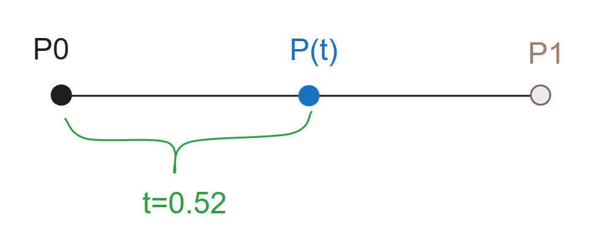

这个称为lerp(Linear Interpolation)或者线性插值；公式如下：
$$
P(t)=(1-t) P_0+t P_1
\\
t \in [0,1]
$$

#### 扩展到三点

当平面上具有三个点，那么按顺序两两做插值，并将插值点连线，对该连线再次插值，获得一个轨迹点；
在参数走遍区间内所有值之后，轨迹点获得的路径轨迹就是贝塞尔插值曲线；
这里三点决定的贝塞尔曲线就是二次贝塞尔曲线；

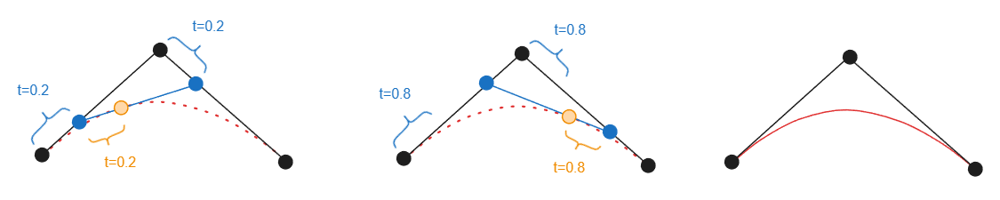

同理如果具有四个点，那么就可以构成三次贝塞尔曲线；

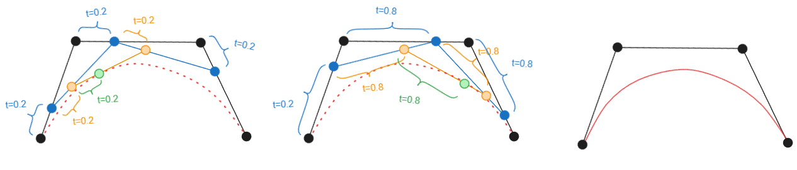

三次贝塞尔曲线就是最常见的一种贝塞尔曲线了；

那么如何以代数方式表达贝塞尔曲线？

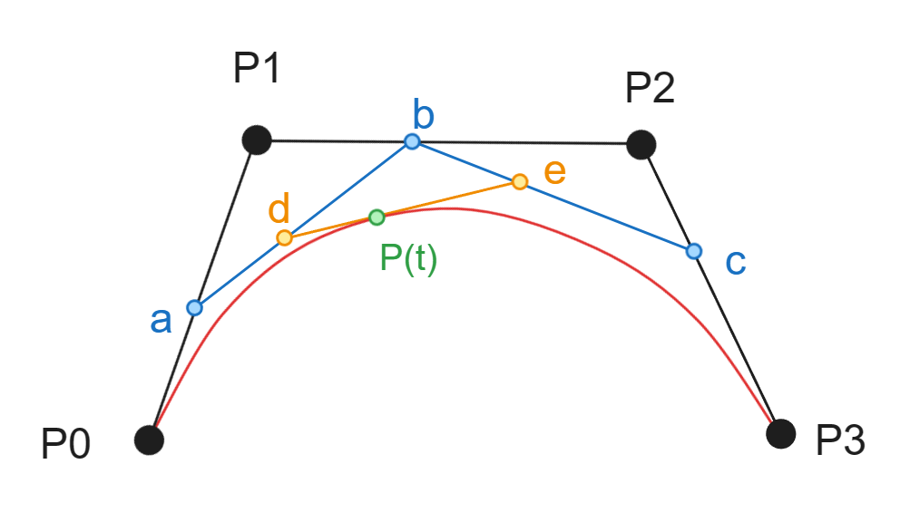

我们将三次贝塞尔曲线的每个点都标记出来，并以插值概念以代数表达，该方法叫做 Decasteljau 算法：
$$
a=lerp(P_0,P_1,t)
\\
b=lerp(P_1,P_2,t)
\\
a=lerp(P_2,P_3,t)
\\
d=lerp(a,b,t)
\\
e=lerp(b,c,t)
\\
P=lerp(d,e,t)
$$

##### 伯恩斯坦式

然后我们对上述式子进行展开和化简：
$$
a=(1-t) P_0 + t P_1 = P_0 - t P_0 + t P_1
\\
b=(1-t) P_1 + t P_2 = P_1 - t P_1 + t P_2
\\
c=(1-t) P_2 + t P_3 =  P_2 - t P_2 + t P_3
\\
d=(1-t) [(1-t) P_0 + t P_1] + t [(1-t) P_1 + t P_2]=(1-t)^2P_0+2(1-t)tP_1+t^2P_2
\\
e=(1-t) [(1-t) P_1 + t P_2] + t [(1-t) P_2 + t P_3]=(1-t)^2P_1+2(1-t)tP_2+t^2P_3
\\
P= (1-t)^3P_0+3t(1-t)^2P_1+3t^2(1-t)P_2+t^3P_3
\\可见
\\
P=\\P_0(-t^3+3t^2-3t+1)+\\P_1(3t^3-6t^2+3t)+\\P_2 (3t^2-3t^3)+\\P_3 (t^3)
$$
这个式子叫做伯恩斯坦（Bernstein）多项式，三个参数多项式在平面的图像如下：

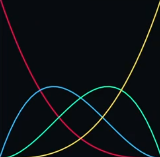

##### 系数多项式

而如果将参数t提取出来那么就得到了系数多项式
$$
P=P_0+t(-3P_0+3P_1)+t^2(3P_0-6P_1+3P_2)+t^3(-P_0+3P_1-3P_2+P_3)
$$
系数多项式可以高效的利用系数来计算轨迹点位置和参数的关系

##### 矩阵型

上述三种依据不同效率进行使用，而计算机中矩阵效率最高，我们考虑将上述式子都化为矩阵形式，如下
$$
P(t)=
\left [ 
\begin{matrix}
1 & t & t^2 & t^3   \\ 
\end  {matrix} 
\right ] 
\left [ 
\begin{matrix}
1 	& 0 	& 0 	& 0   \\ 
-3 	& 3 	& 0 	& 0   \\ 
3 	& -6 	& 3 	& 0   \\ 
-1 	& 3 	& -3 	& 1   \\ 
\end  {matrix} 
\right ] 
\left [ 
\begin{matrix}
P_0     \\ 
P_1     \\ 
P_2     \\ 
P_3     \\ 
\end  {matrix} 
\right ]
$$
由矩阵式可见 前两项合并就得到伯恩斯坦多项式，后两项合并就得到系数多项式；这个形式就非常好用；

#### 长线扩展

如果我们需要将贝塞尔扩展到很长，那么完全可以根据规则将曲线扩展为n次贝塞尔曲线；那么整个多项式影响曲线如下：

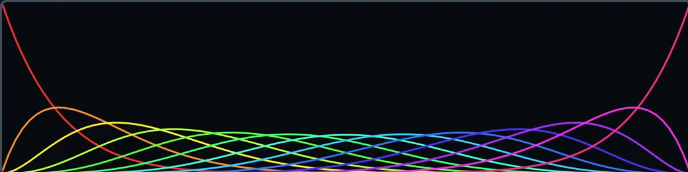

那么这就面临一个问题，在n次贝塞尔曲线需要做局部调整的时候，移动其中一个控制点，那么这个控制点根据规则，其影响会扩散到其他非起点和终点的所有点上，尽管距离越远影响越小，但是依然具有影响；所以我们失去了局部控制曲线的能力；

而且n次贝塞尔曲线若阶次过高，会大量消耗算力；

我们需要在不影响曲线每一个点的情况下控制曲线形状；

### 贝塞尔样条 Bézier Spline

为了得到上述局部控制曲线的能力，我们将三次贝塞尔曲线收尾相连；就得到了贝塞尔样条线

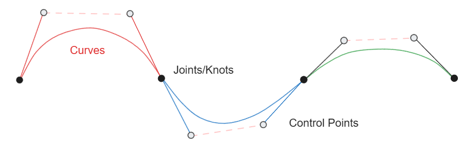

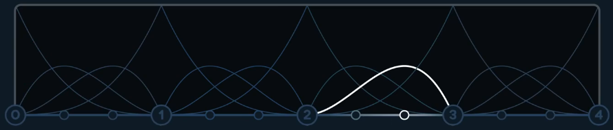

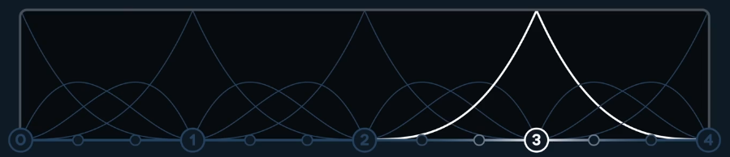

可见某一段中的控制点只能影响段内的曲线状态；而每一个节点可以控制两侧的曲线段状态；

于是我们得到了

-  一个可以局部控制的曲线
-  更加便于计算的曲线
-  曲线每三个点通过一次点

所以贝塞尔样条非常受欢迎，PS中的钢笔工具就是这；

节点是三次曲线的起点或终点，控制点和节点之间的线（控制棒）为起点或者终点的切线；

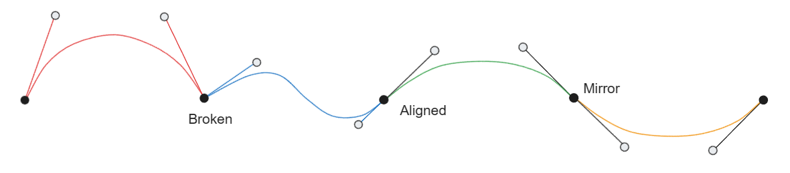

在四段三次曲线拼出的样条线中，可以利用控制点来构造，断点（尖点/Broken）、平行(Aligned)、镜像(Mirror)；

#### 连续性分析

连续性是对曲线时间连接程度的表达；贝塞尔样条是多个三次贝塞尔连接的，那么必考察其连续性；

依然如下图，该样条由四个曲线收尾连接，数学上称之为是C0连续的；如果收尾的的点都不重合那么就是不连续；

如果有一个方块在贝塞尔样条上进行运动，在节点处可能出现角度和速度的忽然变化；此时我们需要研究贝塞尔曲线的导数来一探究竟；

拿出上述的三阶贝塞尔矩阵式：
$$
P(t)=
\left [ 
\begin{matrix}
1 & t & t^2 & t^3   \\ 
\end  {matrix} 
\right ] 
\left [ 
\begin{matrix}
1 	& 0 	& 0 	& 0   \\ 
-3 	& 3 	& 0 	& 0   \\ 
3 	& -6 	& 3 	& 0   \\ 
-1 	& 3 	& -3 	& 1   \\ 
\end  {matrix} 
\right ] 
\left [ 
\begin{matrix}
P_0     \\ 
P_1     \\ 
P_2     \\ 
P_3     \\ 
\end  {matrix} 
\right ]
$$
对其求1、2、3阶导：
$$
P^{(0)}(t)=
\left [ \begin{matrix}
1 & t & t^2 & t^3  
\end  {matrix} \right ] 
...
\\
P^{(1)}(t)=
\left [ \begin{matrix}
0 & 1 & 2t & 3t^2  
\end  {matrix} \right ] 
...
\\
P^{(2)}(t)=
\left [ \begin{matrix}
0 & 0 & 2  & 6t  
\end  {matrix} \right ] 
...
\\
P^{(3)}(t)=
\left [ \begin{matrix}
0 & 0 & 0 & 6   
\end  {matrix} \right ] 
...
$$
三个结果分别理解为：一阶导数为速度velocity，二阶导数为加速度acceleration，三阶导数为急动度jolt；

##### C0连续

若样条线中各三次曲线首尾相连，就都出现了实际0阶连续；也叫C0连续；否则不连续；

即
$$
A(1)=B(0)
$$

##### 一阶连续/C1连续

实际计算结果中，若节点和其两侧控制点为镜像，则速度在节点处数值重合，一阶连续；满足了就可以称之为C1连续；即
$$
A'(1)=B'(0)
$$

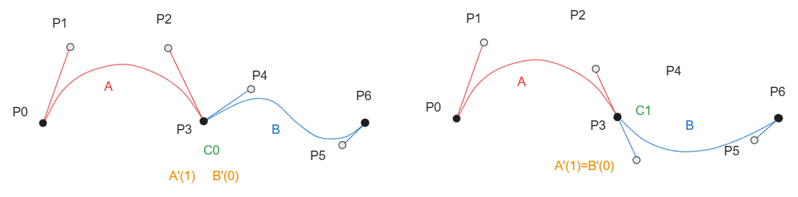

可见前曲线的末端一阶导和后曲线的首端一阶导数值相等，才能把C0升格为C1连续；

##### 二阶连续/C2连续

然后观察二阶导数，当加速度在节点处出现跳变，则说明曲线无法实现C2连续；

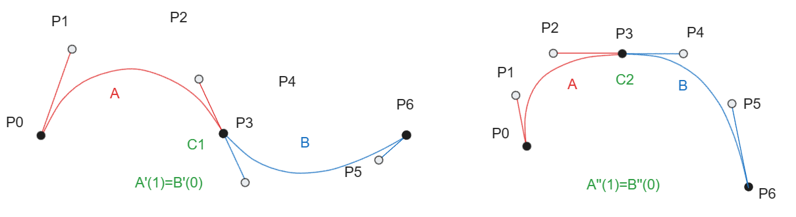
$$
A''(1)=B''(0)
$$
要达成这个条件，则P5需要受到P1、P2、P3的控制，
$$
P_5=P_1+4（P_3-P_2）
$$
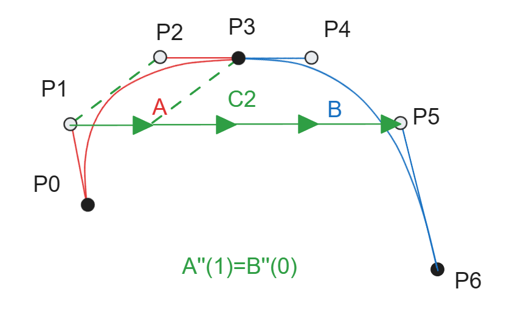

##### C2连续缺点

再次拿出四段组样条：

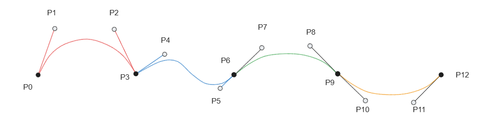

由此我们获得了C2连续的曲线，但是为了达成C2连续，我们再次牺牲了之前讲的样条线的局部控制特性；
由于C2连续性要求
P5被P1、P2、P3控制
P8被P3、P5、P6控制
P11被P7、P8、P9控制
由于C1连续的镜像要求
P2锁定P4
P5锁定P7
P8锁定P10

那么所有的控制点都被前置的点锁定了；
一旦移动几个自由的点都会极大改变整个曲线的形状；
由此我们失去了局部控制的能力；
所以贝塞尔样条想要达到C2连续，则必然牺牲局部控制特性；

##### C3连续

虽然C2连续的情况很糟糕，那么如果曲线想要C3连续会怎么样呢？

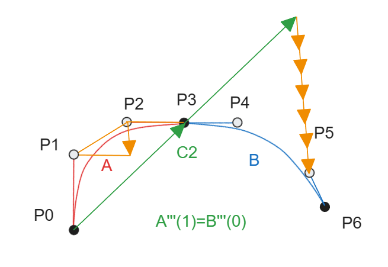
$$
P_6=P_3+(P_3-P_0)+6（P_1-P_2+P_3-P_2）
$$
可见此时，P6由P0、P1、P2、P3决定；如此向后我们连节点都无法控制了，这个情况比上述C2连续时更加糟糕；

情况就显示为，C3连续的样条线对于初始的几个控制点的敏感度极高；
其实此时的这个样条线就是由第一段三次曲线的参数t直接超过1来进行计算拟合的；
那么整个样条线就是一根线，而非多个三次曲线的品拼接；此时就是C无穷连续；所有的导数都是连接的；

这是符合直觉的，因为拼接的原料曲线就是三次贝塞尔曲线，三阶导数之后所有的差异都会被抹平；

##### 连续总结

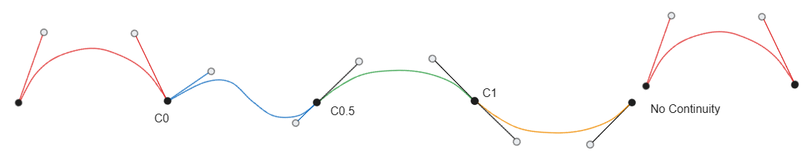

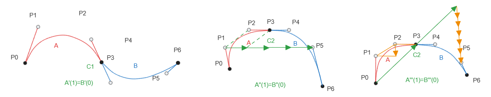

