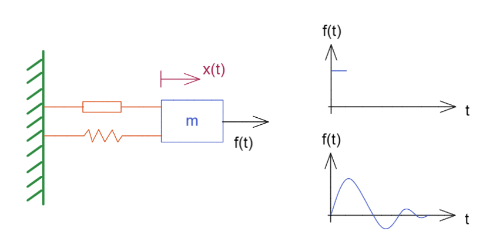
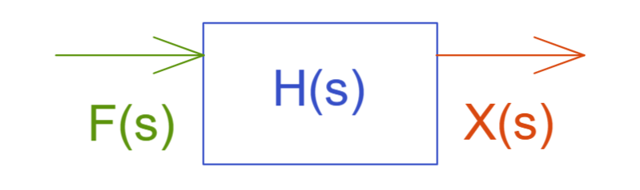

# 线性时不变系统的冲激响应与卷积

[TOC]

LTI system 线性时不变系统  = linear time invariant

Implulse Resporse 冲激响应

Convolution 卷积

## 一、线性时不变系统

有一个运算  $O\{\}$  对输入信号  $f(t) $ 操作，有如下输出：

$O\{f(t) \}=x(t)$

### 叠加原理  superpositon principle

此时在线性系统中有两个输入信号如下：

$O\{f_2(t)\}=x_2(t)$
$O\{af_1(t)\}=ax_1(t)$

那么将这两个信号相加就有

$O\{f_2(t)\}+O\{af_1(t)\}=x_2(t) +ax_1(t)$

这个就是线性空间的叠加原理
$$
O\{a_1 f_1(t)+a_2 f_2(t)\} = a_1x_1(t)+a_2x_2(t)
$$

### 时不变Time Invariant

无论在哪个时间点，向系统输入的信号相同那么其输出也是必然相同的
$$
O\{f(t)\}=x(t)\rightarrow O\{f(t-\tau)\}=x(t-\tau)
$$

### 例：线性弹簧阻尼系统

我们有个带阻尼的弹性系统如图
如果我们给一个短暂外力，就会不断振动然后慢慢停下

那么这个系统的简单写为框图就是

$$
F(s)H(s)=X(s) \\ 
F(s)输入的拉普拉斯变换，
H(s)传递函数，
X(s)输出的拉普拉斯变换
$$
当我们对这个式子进行拉普拉斯逆变换时就能够得到卷积

$L^{-1}[F(s)H(s)]=L^{-1}[X(s)]\Rightarrow f(t)*h(t)=x(t),此处*就是卷积$

该式子的证明可查看附录 <卷积的拉普拉斯变换>

 

