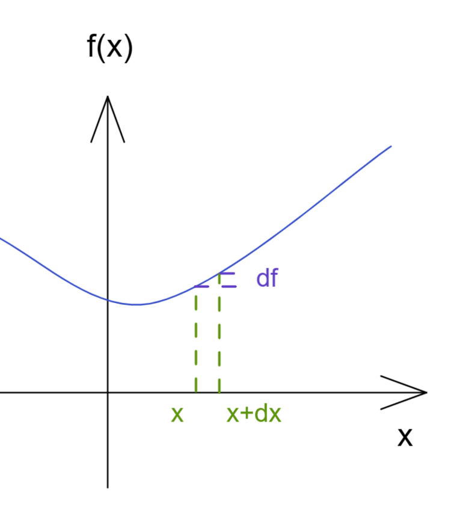
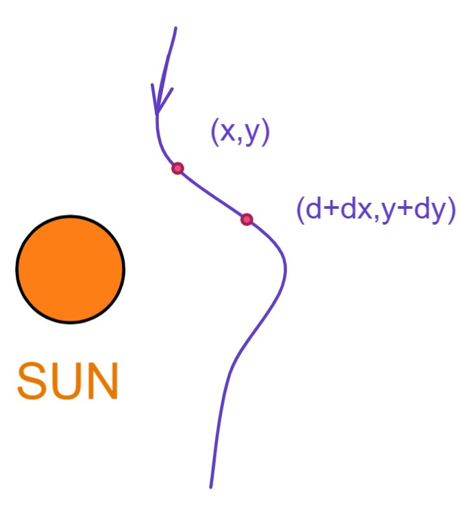
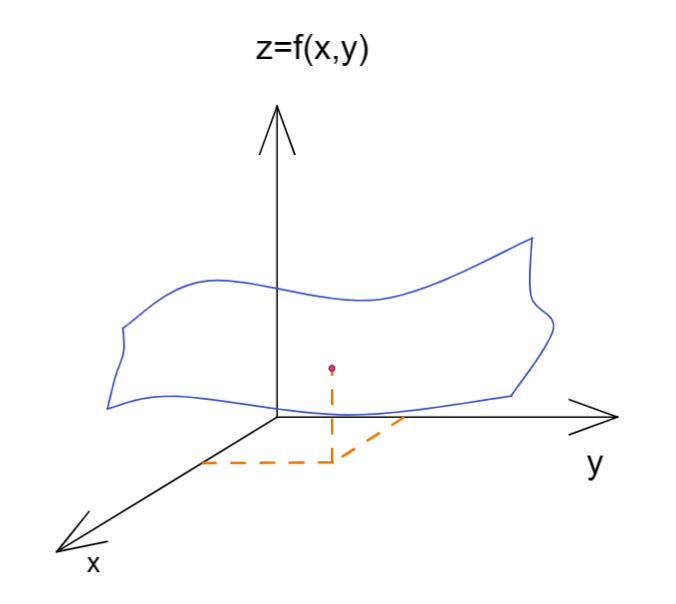

# 偏导数

[TOC]

## 回顾：差分与微分

$\Delta f \equiv f(x+\Delta x)-f(x)$

$d f \equiv f(x+dx)-f(x)$

$d f= f(x+dx)-f(x)=\frac{f(x+dx)-f(x)}{dx}dx \rightarrow df = \frac{df}{dx}dx $

如果因变量的差异出现了不同的两个因素 x y 那么整个微分式写为

$df \equiv f(x+dx,y+dy)-f(x,y)$

## 偏导

### 极限

此时将y因素固定

$\frac{\part F}{\part x} = \lim\limits_{\Delta x \rightarrow 0}\frac{f(x+\Delta x,y)-f(x,y)}{\Delta x}=\frac{f(x+dx,y)-f(x,y)}{dx}$

若将x固定 则有

$\frac{\part F}{\part y} = \lim\limits_{\Delta y \rightarrow 0}\frac{f(x,y+\Delta y)-f(x,y)}{\Delta y}=\frac{f(x,y+dy)-f(x,y)}{dy}$

### 二次偏导

$\frac{\part}{\part x}(\frac{\part F}{\part x})=\frac{\part^2f}{\part x^2}=f_{xx}$

$\frac{\part}{\part y}(\frac{\part F}{\part x})=\frac{\part^2f}{\part y\part x}=f_{yx}$

$\frac{\part}{\part x}(\frac{\part F}{\part y})=\frac{\part^2f}{\part x\part y}=f_{xy}$

$\frac{\part}{\part y}(\frac{\part F}{\part y})=\frac{\part^2f}{\part y^2}=f_{yy}$

对每个因子都微分 所得结果和微分顺序无关
$$
\frac{\part^2f}{\part y\part x} = \frac{\part^2f}{\part x\part y}
$$

### 例

$f(x,y)=\cos(xy)+y^2$

$\frac{\part^2f}{\part y\part x} = \frac{\part^2f}{\part x\part y}=-\sin(xy)-xy\cos(xy)$

### 分解

$df = f(x+dx,y+dy)-f(x,y) = [f(x+dx,y+dy)-f(x,y+dy)]+[f(x,y+dy)-f(x,y)]$

$df = \frac{f(x+dx,y+dy)-f(x,y+dy)}{dx}dx+\frac{f(x,y+dy)-f(x,y)}{dy}dy$
$$
df = \frac{\part f}{\part x}dx+ \frac{\part f}{\part y}dy
$$

 

### 逆向

具有dx 和 dy 组合的多项式 是否可以写为一个全微分式子

$A(x,y)dx+B(x,y)dy = df(x,y)$ 能否一直成立

由先前可见

$\frac{\part^2f}{\part y\part x} = \frac{\part^2f}{\part x\part y} \rightarrow \frac{\part}{\part y}(\frac{\part f}{\part x})= \frac{\part}{\part x}(\frac{\part f}{\part y})\rightarrow \frac{\part A}{\part y }=\frac{\part B}{\part x}$

那么$\frac{\part A}{\part y }=\frac{\part B}{\part x}$这个条件就是可将式子写为一个充要条件

### 例 古典场论

粒子在经过太阳受到的作用力的平面表现为，即外力做功

$F_x dx + F_ydy$

此时 得到一个向量场的描述，那么如果能够将这个式子写为一个式子的全微分来表达，就意味着可以将向量场的功使用一个纯量场的公式来表达;

即为

$F_x dx + F_ydy = \vec F \cdot d\vec r = -dU$

如果能够做到，那么这个力叫保守力；这直接和能量守恒有关；

### 例 空间曲面

$z=f(x,y)$

$x=x(y,z),dx=(\frac{\part x}{\part y })_zdy+(\frac{\part x}{\part z})_ydz$

$y=y(x,z),dy = (\frac{\part  y}{\part x})_zdx + (\frac{\part y}{\part z})_xdz$
$$
(\frac{\part x}{\part y })_z \cdot(\frac{\part y}{\part x })_z =1 \\
(\frac{\part y}{\part z })_x \cdot(\frac{\part z}{\part x })_y \cdot(\frac{\part x}{\part y })_z =-1
$$

## 多元泰勒展开

### 推断

可将多元函数写为

$f(x,y)a_0+[a_{1x}x+a_{1y}y]+[a_{xx}x^2+a_{yy}y^2+a_{xy}xy]+...$

此时对原点进行多阶微分计算

0阶：

$f(0,0)=a_0$

1阶：

$\frac{\part f}{\part x}(x,y)=a_{1x}+[2a_{xx}x+a_{xy}y]+...$

$\frac{\part f}{\part x}(0,0)=a_{1x}\\\frac{\part f}{\part y}(0,0)=a_{1y}  $

2阶：

$\frac{\part^2f}{\part x^2} = (2!)a_{xx}+0 \\ \frac{\part^2f}{\part y^2} = (2!)a_{yy}+0 \\ \frac{\part^2f}{\part x\part y}=a_{xy}+0$

### 多元麦克劳伦

$f(x,y) \\ = f(0,0)+[\frac{\part f}{\part x}x+\frac{\part f}{\part y}y]+\frac{1}{2!}[\frac{\part ^2f}{\part x^2}x^2+\frac{\part ^2f}{\part y^2}y^2+2\frac{\part^2 f}{\part x \part y}xy]+...\\ =f(0,0)+\sum\limits_i\frac{\part f}{\part x_i}x_i+\frac{1}{2!}\sum\limits_i\sum\limits_j\frac{\part^2 f}{\part x_i\part x_j}x_iy_y+...$

 我们注意到 2阶项是一个特殊算子作用在函数f上：

$\frac{\part ^2f}{\part x^2}x^2+\frac{\part ^2f}{\part y^2}y^2+2\frac{\part^2 f}{\part x \part y}xy=(x\frac{\part}{\part x}+y\frac{\part}{\part y})^2f$

那么我们可以把泰勒级数改编为

$f(x,y)=\sum\limits^\infin_{n=0}\frac{1}{n!}(x\frac{\part}{\part x}+y\frac{\part}{\part y})^n f|_{0,0}$

那么对于任意一点展开 则得到通用公式
$$
f(x,y)=\sum\limits^\infin_{n=0}\frac{1}{n!}(\Delta x\frac{\part}{\part x}+\Delta y\frac{\part}{\part y})^n f|_{x_0,y_0} \\ \Delta x= x-x_0 \\ \Delta y = y-y_0
$$

