# 线性代数   Linear Algebra

[toc]

**Αα、Ββ、Γγ、Δδ、Εε、Ϝϝ、Ζζ、Ηη、Θθ、Ιι、Κκ、Λλ、Μμ、Νν、Ξξ、Οο、Ππ、Ρρ、Σσ、Ττ、Υυ、Φφ、Χχ、Ψψ、Ωω**

$R = 
\left ( 
\begin{matrix}
a & b   \\
c & d   \\ 
\end  {matrix} 
\right ) $

$$
\left (\begin{matrix}V'_x   \\V'_y   \\ \end {matrix}\right ) =\left (\begin{matrix}0 & -1   \\1 & 0   \\ \end {matrix}\right ) \left (\begin{matrix}V_x   \\V_y   \\ \end {matrix}\right )
$$

$$
R = 
\left ( 
\begin{matrix}
a & b   \\
c & d   \\ 
\end  {matrix} 
\right )

R = 
\left (\begin{matrix}
a & b   \\
c & d   \\ 
\end {matrix}\right )
$$

向量和线性代数时理论分析的常用工具，大多时候线性操作一般表现为矩阵；

## 引、

### 例1 二维旋转 2D rotation

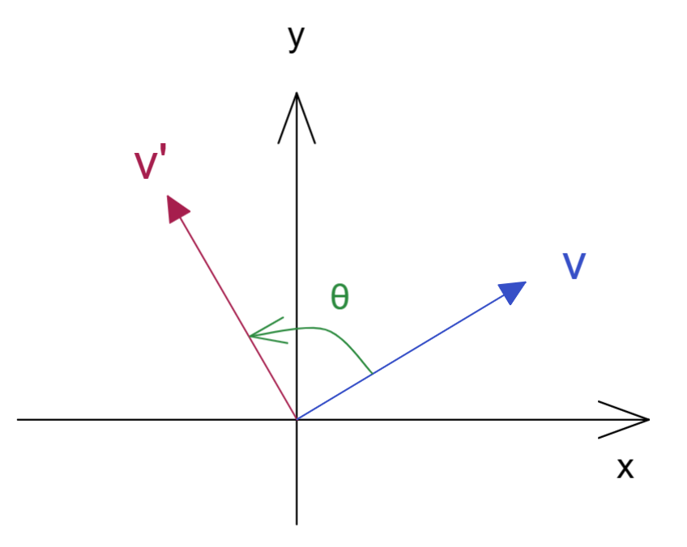

一个XY坐标系中的向量$V$，被旋转操作转到  $V'$  处,旋转角度为 $\theta$ ，那么就得到关系式：

$\vec V'=R(\theta)\vec V$

其实这里的操作可以使用各一个矩阵来表达

$R (\theta) =
\left ( 
\begin{matrix}
\cos\theta & -\sin\theta   \\
\sin\theta &  \cos\theta   \\ 
\end  {matrix} 
\right )$

其实这个矩阵叫做othogonal matrix  正交矩阵

我们设 $\theta = \pi/2$  得到矩阵 

$R (\frac{\pi}{2})= 
\left ( 
\begin{matrix}
0 & -1   \\
1 & 0   \\ 
\end  {matrix} 
\right )$

于是根据矩阵乘法就能得到如下结果

$\left (\begin{matrix}
V'_x   \\
V'_y   \\ 
\end {matrix}\right ) 
=
\left (\begin{matrix}
0 & -1   \\
1 & 0   \\ 
\end {matrix}\right ) 
\left (\begin{matrix}
V_x   \\
V_y   \\ 
\end {matrix}\right )$

$V'_x=-V_y ,V'_y=V_x   $

那么如果我们对一个向量进行多次这样的旋转操作，结果是否能够符合某种加法或乘法运算（即在一个群中）？

那么我们就进行两次旋转 ，旋转角度为 $\theta_1,\theta_2$ 

$R(\theta_1)R(\theta_2) \\
= 
\left (\begin{matrix}
\cos\theta_1 & -\sin\theta_1   \\
\sin\theta_1 &  \cos\theta_1   \\ 
\end {matrix}\right )
\left (\begin{matrix}
\cos\theta_2 & -\sin\theta_2   \\
\sin\theta_2 &  \cos\theta_2   \\ 
\end {matrix}\right ) \\
=
\left (\begin{matrix}
\cos\theta_1\cos\theta_2- \sin\theta_1\sin\theta_2 & 
-\cos\theta_1\sin\theta_2-\sin\theta_1\cos\theta_2 \\
\cos\theta_1\sin\theta_2+ \sin\theta_1\cos\theta_2  &
\cos\theta_1\cos\theta_2- \sin\theta_1\sin\theta_2 \\ 
\end {matrix}\right ) \\
=
\left (\begin{matrix}
\cos(\theta_1+\theta_2) & -\sin(\theta_1+\theta_2)   \\
\sin(\theta_1+\theta_2) &  \cos(\theta_1+\theta_2)   \\ 
\end {matrix}\right )\\
=R(\theta_1+\theta_2)$

可见两次旋转操作即将角度相加然后一起旋转操作

### 例2 耦合振子 coupled oscillators

我们写出该模型的运动方程Equations Of Motion EOM；

$m\frac{d^2x_1}{dt^2}=-k_1x_1+k_{12}(x_2-x_1) \\ m\frac{d^2x_2}{dt^2}=-k_2x_2-k_{12}(x_2-x_1)$

将该式展开 可以拟出一个矩阵

$m \left (\begin{matrix}
\ddot x_1   \\
\ddot x_2   \\ 
\end {matrix}\right ) 
=
-\left (\begin{matrix}
k_1+k_{12} & -k_{12}   \\
-k_{12} & k_2+k_{12}    \\ 
\end {matrix}\right ) 
\left (\begin{matrix}
x_1   \\
x_2   \\ 
\end {matrix}\right )$

我们得到了一个对称的实数矩阵，那么如果此处的$k_{12}=0$ 那么两个物体的运动则充分解耦，其实也就是说中间弹簧不参与力的运算，即处于自然状态，那么其实就是两个物体运动方式一样；

### 例3 生命起源  核酸链的变异问题

我们知道遗传因子的含氮碱基有 A（腺嘌呤）   G（鸟嘌呤）  C（胞嘧啶）  T（胸腺嘌呤）U（尿嘧啶）

一般RNA单链的核糖核苷酸的含氮碱基为  		A G C U 

一般DNA双链的脱氧核糖核苷酸的含氮碱基为  A G C T 

这里我们以RNA为例  ，为了简化分析   我们将 嘌呤 和 嘧啶 分开  ，嘌呤purines为R  嘧啶pyrimidine为Y

我们在一个链上把R 和 Y 排列上去 ，就能得到一个带有遗传信息的RNA ，如图；

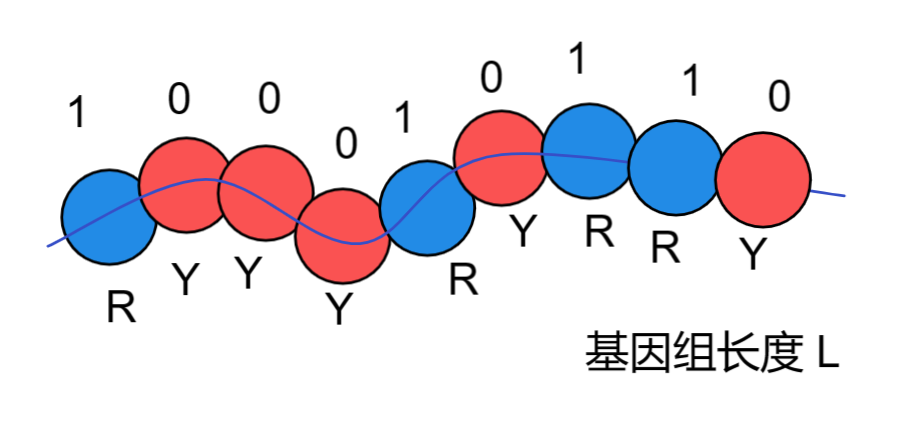

那么我们就是得到了长度L的基因长度，那么这个长度的片段具有的序列状态形式就有 $2^L$种；

那么我们假定那么多序列状态中有些特定序列会在环境中较好的存活下来，成为总体片段状态的大多数，此时自然已经开始选择最符合环境的“生物”了；

那么每种状态都有自己的适应力，对于某个序列 $i$，种群环境适应力设为 $f_i - fitness$ ，当前种群数量设为 $N_i$ ，于是我们得到

$\frac{dN_i}{dt}=f_i N_i \rightarrow N_i(t)=N_i(0)e^{f_i t}$

即为种群数量随着时间而改变的程度由【当前种群数】和【种群环境适应力】两个因子决定；

其实这样的微分式子就是自然指数函数的微分形式，于是得到右式；

看右式可推测适应力决定了长期的种群数量，是慢慢消亡还是指数增长；

我们设定一个当前序列 $i$ 的种群数量$N_i(t)$在所有片段组成的总数量$N(t)$中的比例 $x_i(t)$

$x_i(t)=\frac{N_i(t)}{N(t)},N(t)=\sum\limits_i N_i(t)$

如果我们找到所有适应力最强为 $f_\max=\max \{f_i\}$  ,那么最终总数量所有状态都会成为该序列；

$x_\max(t\rightarrow \infin)=1,x_i(t\rightarrow \infin)=0$

**但事实并非那么简单，如果按上述发展最终世界就只存在一种永恒的物种，永恒是显然违反逻辑的**

上述内容都是没有考虑到基因片段在复制的时候发生突变的情况，即为序列上的某些碱基变化导致其突变后成为不同的序列状态；

我们假设有个突变情况

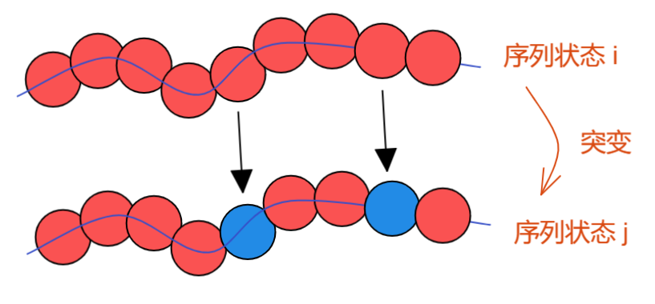

一个序列复制的时候出现了两个碱基的变化，假设每个碱基的突变可能性为等可能，并设为 $u,u\in[0,1]$

那么整个序列的突变可能性就是 $u^2(1-u)^{L-2}$

既然序列可以变化，那么我们可以将序列之间定义一个距离，以表达两个序列状态的区别程度，将两个序列互相变化所需的碱基变化个数做了定量，这个概念就相当于物种基因相似性，相似性越高距离越小；

那么就设定序列状态的突变距离为 $d_{ij}=d_{ji}$

那么更具上述突变可能性的式子就可以写为突变可能性的矩阵：

$m_{ij}=u^{d_{ij}}(1-u)^{L-d_{ij}}$

最简单的序列突变举证展开如下

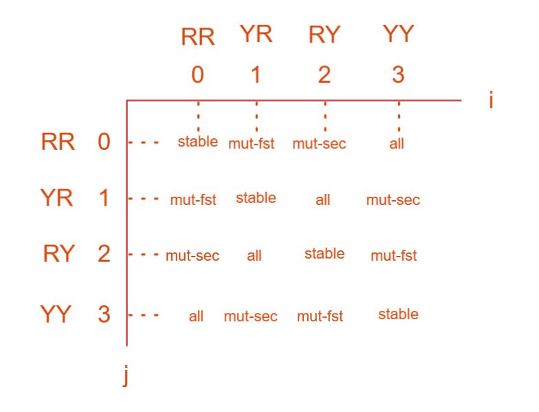

我们将所有 【序列$i$】自身的延续 以及 从【序列$j$】突变到 【序列$i$】 的 所有突变可能性相加，就是把矩阵某一行值全部相加；

$\sum\limits_i m_{ij}=\sum\limits_i u^{d_{ij}}(1-u)^{L-d_{ij}}=[u+(1-u)]^L=1$

即将所有序列 突变到某固定序列的几率 全部相加就为1，符合常识；

接下来我们对所有序列进行突变操作，并计算适应力，于是需要修正上述没有突变时的适应力公式$\frac{dN_i}{dt}=f_i N_i$

$\frac{dN_i}{dt}=\sum\limits_{j}m_{ij}f_j N_j=\sum\limits_{j}F_{ij} N_j$

这里我们首先按照无突变形式计算其序列的增长能力，然后将其完整增长后的序列数量做突变操作，计算得到【非序列$i$】突变为【序列$i$】而对于【序列$i$】数量的增长贡献，同时计算得到【序列$i$】突变为【非序列$i$】而对于【序列$i$】数量的削减贡献；

所以此时$F_{ij}$就成为了适应力矩阵，其将突变的可能性囊括进来了；
$$
\frac{dN_i}{dt}=\sum\limits_{j}F_{ij} N_j
$$
所以我们得到了这样的修正后的公式，其计算结果的情况如下

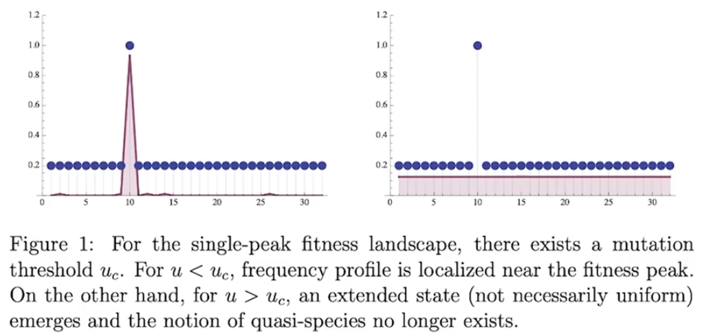

当在海洋的原汤中，不同的碱基形成不同序列

在总体突变可能性极大的时候（辐射等其他恶劣环境导致），某一获得高适应性的序列无法保持自己的基因稳定，就快速突变为其他低适应性序列，没有机会扩展自己的种类数量，有特定序列的生命此时难以产生；

在总体突变可能性较低的时候（环境冷却或稳定下来后），某一获得高适应性的序列可以保持自己基因稳定，就可以不断增加其在总数中的比例，这个过程不断进行，序列不断有序化，并有较稳定的传承，生命由此而产生；

那么这样的突变值在分子生物学对地球上的多数物种进行测定的时候验证了这一猜想：多数稳定发展的物种基因突变几率较低；

我们在高突变情况下模拟如下：

就算有高适应的种类也无法保持其种类的数量；

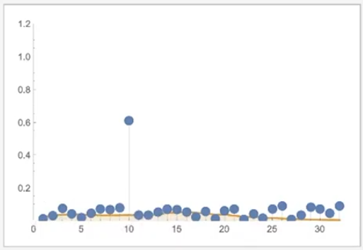

低突变情况下的模拟如下：

出现了某高适应种群数量占据大部分的情况；其突变情况越小peak越是高且细；

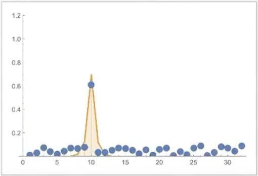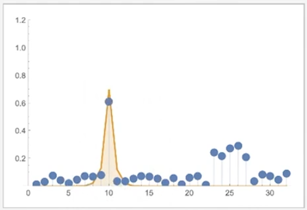

但是这里我们发现第二个图中有一个适应力的高原，我们观察在特定变异可能性情况下不同种群数量的变化：出现了单独超高适应暂时胜出peak，但最后让位于另一丰富多样的高适应种群组mesa；

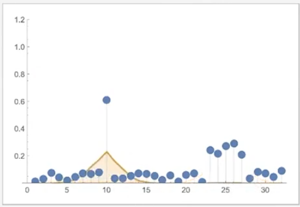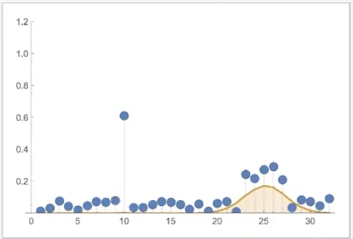

其种群数量变化如下

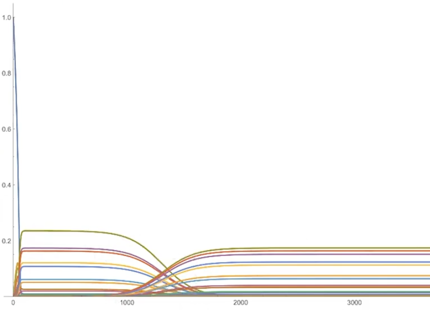

长期来看，超高适应性的种群对于突变的忍受能力较差，而一般适应性但是种群内多样性丰富的种群反而可以在长期竞争中胜出；

可见对于人类来说，就是那个peak，单一超高适应种群，对于突变非常敏感；而mesa就相当于具有多重变异个体的RNA种群（主要是病毒），可以在长期获胜；

