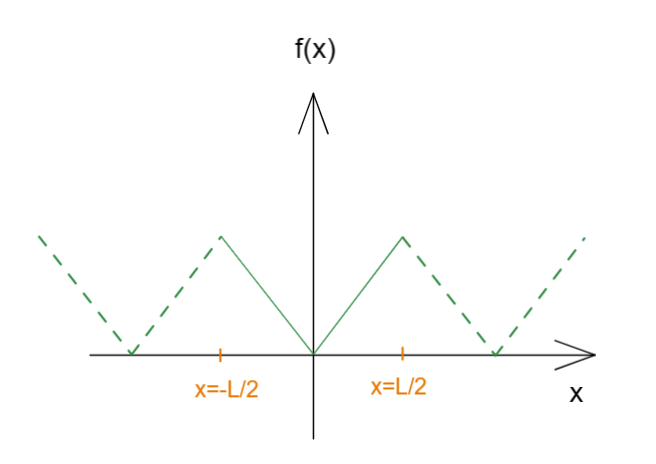

# 傅里叶转换 Fourier Transform    FFT

[TOC]

## 傅里叶级数

首先我们有一个周期函数

在线性代数一章节中讲到过，一个空间中的向量可以使用其空间内的基底计算组合而成；
那么如果将这个在二维空间中的周期函数也看作为一个向量，每个元素就是其函数值$f(x)$，鉴于x涉及连续情况，也可以将其视作无限个元素的向量，那么既然现有函数可以视作向量，这个原函数是否也可以使用两个基底来表达出这个函数呢？

那么我们需要寻找曾见到过的函数作为基底，那么一组具有周期性且正交的函数就是  $\cos$  和  $\sin$ 函数；

这里先把结论给出：
$$
f(x) = \frac{1}{2}a_0+\sum\limits^\infin_{n=1}a_n\cos(\frac{2n\pi x}{L})+b_n\sin(\frac{2n\pi x}{L})
$$
这个傅里叶公式来历推导内容详见附录；

