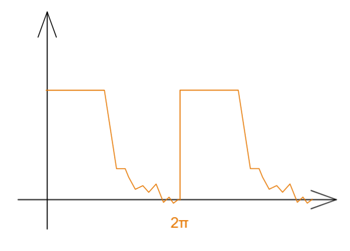

# 傅里叶级数与傅里叶变换

[TOC]

## 三角函数的正交性

三角函数正交性是傅里叶级数的基础

我们有个 三角函数系 集合   $\{ \sin 0x=0 , \cos 0x=1, \sin x \cos x,\sin 2x \cos 2x,...,\sin nx \cos nx,... \}$  

即  $\{ \sin nx ,\cos nx \},n = 0,1,2,...$

那么什么是正交，这里有个定义 ：

$\int^\pi_{-\pi} \sin nx \cos mx dx =0 $

$\int^\pi_{-\pi} \cos mx \cos nx dx =0  , n\neq m$

那么上述的三角函数正交的情况是怎么来的？
简单来说，其实正交就是垂直 ， 也就是两个向量的内积为0的时候就是正交；

$\vec a \cdot \vec b = |\vec a||\vec b|\cos\phi = |\vec a||\vec b| \cdot 0=0$ 就平面上来说正交是这样，那么如果用向量表达出来，假设两者在n维度场：

$\vec a \cdot \vec b = a_1 b_1+a_2 b_2+...+a_n b_n=\sum\limits^\infin_{i=1}a_i b_i=0$

如果上述求和公式并非取整数，而是连续实数，那么上述的求和就成为了积分；

于是当我们将向量转为无限维的函数，意味着其向量内元素是无限且稠密的，但某个元素总是可用函数自变量表达
$$
a \cdot b =\int^{x_1}_{x_0}f(x)g(x)dx \\a=f(x),b=g(x) ,x\in(x_0,x_1)
$$
由此我们定义出了函数之间的内积以及函数的正交；

于是我们要在三角函数上证明，，利用三角积化和差公式，以及奇函数性质：

$\int^\pi_{-\pi} \cos nx \cos mx dx , n\neq m \rightarrow  \\ 
\frac{1}{2}\int^\pi_{-\pi} \cos (n-m)x \cos (n+m)x dx \\=
\frac{1}{2}\int^\pi_{-\pi} \cos (n-m)x dx \frac{1}{2}\int^\pi_{-\pi}\cos (n+m)x dx \\=
\frac{1}{2}\frac{1}{n-m} \sin (n-m)x |^\pi_{-^\pi} + \frac{1}{2}\frac{1}{n-m}\sin (n+m)x|^\pi_{-^\pi} =
0+0=0$

同样我们也可验证：
$\int^\pi_{-\pi} \cos nx \sin mx dx = 0, n\neq m$
$\int^\pi_{-\pi} \sin nx \sin mx dx = 0, n\neq m$

那么如果 $n = m$ ,就有

$\int^\pi_{-\pi} \cos nx \cos mx dx , n=m\neq0  \rightarrow \\
 \int^\pi_{-\pi} \frac{1}{2}[1+\cos2mx] dx \\= 
\frac{1}{2} [\int^\pi_{-\pi} 1 dx+ \int^\pi_{-\pi}\cos2mx dx ]  \\=
\frac{1}{2} [\int^\pi_{-\pi} 1 dx+ \int^\pi_{-\pi}\cos0x\cos2mx dx ]  \\=
\frac{1}{2}[\pi+0]=\pi$

那么我们将上述所有三角函数正交的情况罗列出来：
$$
\int^\pi_{-\pi} \sin nx \cos mx dx =0 \\ 
$$

$$
\int^\pi_{-\pi} \sin nx \sin mx dx = 0 ,n\neq m \\ \int^\pi_{-\pi} \sin nx \sin mx dx = \pi ,n=m\neq0 \\ \int^\pi_{-\pi} \sin nx \sin mx dx = 2\pi ,n=m=0
$$

$$
\int^\pi_{-\pi} \cos nx \cos mx dx = 0 ,n\neq m \\ \int^\pi_{-\pi} \cos nx \cos mx dx = \pi ,n=m\neq0 \\ \int^\pi_{-\pi} \cos nx \cos mx dx = 2\pi ,n=m=0
$$

## 周期为 $2\pi$ 的函数展开为傅里叶级数

拿到一个周期为$T = 2\pi$ 的函数  $f(x)=f(x+2\pi)$  

将其展开为三角函数的加和，就是级数，两种表达方式：
$$
f(x)=\sum\limits^\infin_{n=0}a_n\cos nx+\sum\limits^\infin_{n=0}b_n\sin nx \\ f(x)=a_0\cos0x+\sum\limits^\infin_{n=1}a_n\cos nx+b_0\sin0x+\sum\limits^\infin_{n=1}b_n\sin nx=a_0+\sum\limits^\infin_{n=1}a_n\cos nx+\sum\limits^\infin_{n=1}b_n\sin nx
$$

我们需要求出这里的 $a_0$ ,

对上述第二式两边积分 
$\int^\pi_{-\pi}f(x)dx=\int^\pi_{-\pi}a_0dx+\int^\pi_{-\pi}\sum\limits^\infin_{n=1}a_n\cos nx dx+\int^\pi_{-\pi}\sum\limits^\infin_{n=1}b_n\sin nx dx =
a_0\int^\pi_{-\pi}dx+0+0=a_0x|^\pi_{-\pi}=2\pi a_0$

于是可以得到       $a_0=\frac{1}{2\pi}\int^\pi_{-\pi}f(x)dx$   ，这个公式有时为了后续计算方便通常两侧都乘2 得到 
$$
 a_0=\frac{1}{2\pi}\int^\pi_{-\pi}f(x)dx ,  a'_0=\frac{1}{\pi}\int^\pi_{-\pi}f(x)dx  
$$

接下来求  $a_n$  ，我们对等式两侧乘以 $\cos mx$ ，然后两侧进行积分 

$\int^\pi_{-\pi}f(x)\cos mx dx \\
=\int^\pi_{-\pi}a_0\cos mxdx+\int^\pi_{-\pi}\sum\limits^\infin_{n=1}a_n\cos nx\cos mx dx+\int^\pi_{-\pi}\sum\limits^\infin_{n=1}b_n\sin nx \cos mxdx\\
=0+\int^\pi_{-\pi}\sum\limits^\infin_{n=1}a_n\cos nx\cos mx dx+0$

此时我们观察到 上式仅在$n=m$的时候出现非零项

$\int^\pi_{-\pi}f(x)\cos nx dx =a_n\int^\pi_{-\pi}\cos^2 nx dx=a_n\pi $
$$
a_n = \frac{1}{\pi}\int^\pi_{-\pi}f(x)\cos nx dx
$$

接下来求解 $b_n$  我们对等式两侧乘以 $\sin mx$ 然后对两侧进行积分

$\int^\pi_{-\pi}f(x)\sin mx dx \\
=\int^\pi_{-\pi}a_0\sin mxdx+\int^\pi_{-\pi}\sum\limits^\infin_{n=1}a_n\cos nx\sin mx dx+\int^\pi_{-\pi}\sum\limits^\infin_{n=1}b_n\sin nx \sin mxdx\\
=0+0+\int^\pi_{-\pi}\sum\limits^\infin_{n=1}b_n\sin nx\sin mx dx$

此时我们观察到 上式仅在$n=m$的时候出现非零项

$\int^\pi_{-\pi}f(x)\cos nx dx =b_n\int^\pi_{-\pi}\sin^2 nx dx=b_n\pi $
$$
b_n = \frac{1}{\pi}\int^\pi_{-\pi}f(x)\sin nx dx
$$

那么我们得到了完整的傅里叶级数的展开
$$
f(x)= \frac{a'_0}{2} +\sum\limits^\infin_{n=1}a_n\cos nx+\sum\limits^\infin_{n=1}b_n\sin nx= a_0 +\sum\limits^\infin_{n=1}a_n\cos nx+\sum\limits^\infin_{n=1}b_n\sin nx \\  a'_0=\frac{1}{\pi}\int^\pi_{-\pi}f(x)dx, a_0=\frac{1}{2\pi}\int^\pi_{-\pi}f(x)dx \\  a_n=\frac{1}{\pi}\int^\pi_{-\pi}f(x)\cos nxdx \\  b_n=\frac{1}{\pi}\int^\pi_{-\pi}f(x)\sin nxdx
$$

