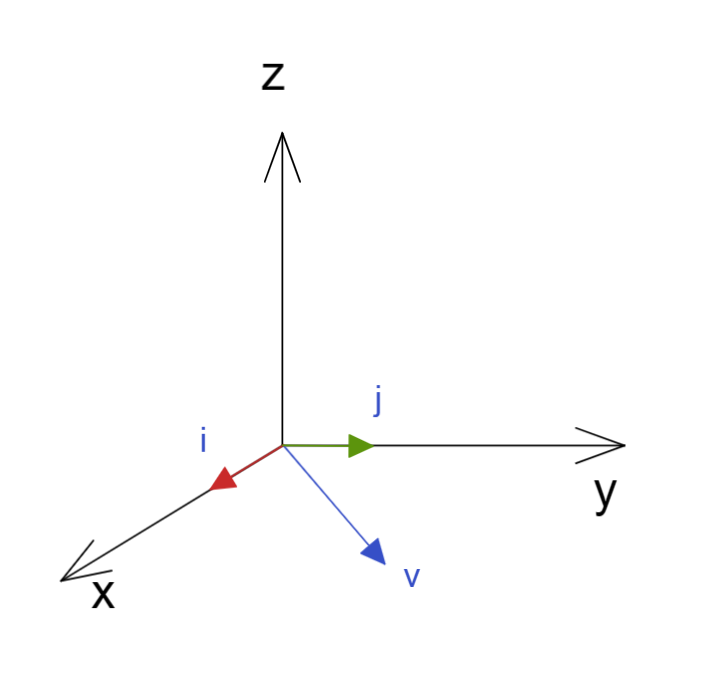
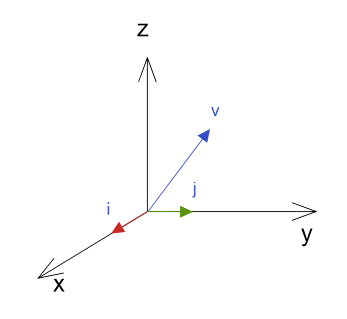

$$
R = 
\left (\begin{matrix}
a & b   \\
c & d   \\ 
\end {matrix}\right )
$$

## 空间向量

有个线性空间的线性向量，表达为

$\vec v = v_x\hat i+v_y\hat j+v_z\hat k $

什么是线性向量？

有向量 $\vec a, \vec b, \vec c $ 在向量空间内应该满足：
$\vec a + \vec b = \vec b + \vec a$

$(\vec a + \vec b)+ \vec c =  \vec a+(\vec b+ \vec c)  $

$\lambda (\vec a + \vec b)=\lambda\vec a + \lambda\vec b  $

$(\lambda+\mu)\vec a = \lambda\vec a + \mu\vec a$

$\lambda(\mu\vec a)=(\lambda\mu )\vec a$

存在零向量

$\vec a +\vec 0=\vec a$

存在单位向量

$1\times \vec a = \vec a$

有负向量

$\vec a +(-\vec a)=0$

## 线性独立性

我们有个N 个非零向量 $ \vec v_1,\vec v_2,\vec v_3,...,\vec v_N  $  可以组成

$ c_1\vec v_1+c_2\vec v_2+c_3\vec v_3+...+c_N\vec v_N=\vec 0$

那么显然系数都为0的时候才才会出现上述式子，那么我们可以说 这N 个向量具有线性独立性

那么我们如何严格证明各个非零向量线性独立呢？

$\vec v = v_x \hat i + v_y \hat j \rightarrow v_x \hat i + v_y \hat j -\vec v = 0$

有上述可见两个解， $0,0,0 \ \ and \ \ v_x,v_y,-1$

那么可见没有三者出现线性独立，第二个解表达了v的线性相依；

如果这里的$v_z$ 不为 0 ，那么就有

$  \vec v = v_x \hat i + v_y \hat j + v_z \hat k  $

我们为了证明 $\hat i,\hat j, \vec v $ 之间线性独立，则构建

$c_1 \hat i + c_2\hat j +c_3\vec v = 0 \rightarrow c_1 \hat i \cdot \hat k + c_2\hat j\cdot \hat k +c_3\vec v\cdot \hat k = 0 \rightarrow  0+0+c_3 v_z =0$

由于 $v_z\neq 0 $  ，那么 $ c_3=0$ , 则

$c_1 \hat i + c_2\hat j = 0 \rightarrow c_1 \hat i\cdot \hat i + c_2\hat j \cdot \hat i = 0 \rightarrow c_1 \hat i\cdot \hat i + 0 = 0 \rightarrow c_1=0$

$c_1 \hat i + c_2\hat j = 0 \rightarrow c_1 \hat i\cdot \hat j + c_2\hat j \cdot \hat j = 0 \rightarrow 0 + c_2\hat j \cdot \hat j = 0  \rightarrow c_2=0$

所以 我们证明 $\hat i,\hat j, \vec v $ 之间线性独立；

可见线性独立 的向量 不一定互相垂直 ， 但是如果互相垂直 ，就一定线性独立；

如果我们能够在一个空间最多找到 N 个线性独立的向量 ，那么个 N  就是该空间的 dimension  维度/秩 ；

## 内积 / 狄拉克符号

这里引入狄拉克符号，通常用于量子力学的推导，这里先介绍了

我们可以简单定义符号 

$\langle a | =  
\left (\begin{matrix}
a_1 & a_2 & a_3  
\end {matrix}\right )$ 

$ | b \rangle=  
\left (\begin{matrix}
b_1 \\ b_2 \\ b_3  
\end {matrix}\right )$

$\langle a| b\rangle=\langle b | a\rangle^*$

$\langle a| \lambda b +\mu c \rangle = \lambda \langle a| b\rangle+\mu \langle a| c\rangle $

这边 的 * 为共轭  用在 带有复数的向量的内积必须进行的共轭处理（证明略）；

我们在 N 维的向量空间取处 所有互相垂直的 单位向量 ，两两内积，就能够得到很多正交矩阵

$\langle \hat e_i | \hat e_j \rangle = \delta_{ij} \ \ ;\ \ i,j = 1,2,3,...,N$

这里的 $\delta_{ij}$ 为克罗内克尔delta符号 （Kronecker delta symbol） 其具有性质

$\delta _{ij} = \left\{
\begin{aligned}
1 &, &i=j \\
0 &, &i\neq j
\end{aligned}
\right. $

可见其就是一个N维的对角的单位矩阵，如果这里的基向量不是垂直的，那么就会出现一个特殊的矩阵；

那么我们可以得到 向量必然可用的展开方式：
$$
|a\rangle = \sum\limits_{i=1}^{N}a_i  | \hat e_i \rangle
$$
其实就相当于在N维空间的向量$\vec a = a_1\hat e_1 +a_2\hat e_2  +...+a_N\hat e_N , \ e_1,e_2,...,e_N 都为单位基向量$

若想要得到向量在空间的某个基方向上的分量，就可以如下操作

$\langle\hat e_j| a\rangle = \sum\limits_{i=1}^{N}a_i\langle\hat e_j|\hat e_i\rangle = \sum\limits_{i=1}^{N}a_i\delta_{ij} = a_j$

那么根据上面们得到了内积的来源 

$|a\rangle = \sum\limits_{i=1}^{N}a_i  | \hat e_i \rangle \rightarrow \langle a| = \sum\limits_{i=1}^{N}a_i^*  \langle\hat e_i |  $

$|b\rangle = \sum\limits_{i=1}^{N}b_j | \hat e_j \rangle$

上述两式做内积

$\langle a| b\rangle  =\sum\limits_i\sum\limits_j a^*_i b_j\langle \hat e_i| \hat e_j\rangle  =\sum\limits_i\sum\limits_j a^*_i b_j \delta_{ij}  =\sum\limits_i a^*_i b_i$

### 线性操作

将 一个 向量 进行线性操作 把一个向量 变换为另一个向量 该操作的表达方式就是矩阵

我们可以使用狄拉克符号表达出来

$|y\rangle = M | x \rangle $

由于其在线性空间，那么可以得到

$M(\lambda|a\rangle + \mu | b\rangle) = \lambda M | a\rangle + \mu M| b\rangle$

我们把向量展开

$|y\rangle = A | x \rangle $

$ x \rangle = \sum\limits_i x_j| \hat e_j \rangle$

$ y \rangle = \sum\limits_j y_j| \hat e_j \rangle$

$A|x\rangle= \sum\limits_j x_j A|\hat e_j\rangle  = \sum\limits_j  y_j|\hat e_j\rangle \rightarrow  \langle \hat e_i \sum\limits_j x_j A|\hat e_j\rangle  =\langle \hat e_i \sum\limits_j  y_j|\hat e_j\rangle \rightarrow \sum\limits_j x_j\langle\hat e_i|A|\hat e_j\rangle = \sum\limits_j y_j \langle\hat e_i|\hat e_j\rangle$

 所以我们得到 $A_{ij}=\langle\hat e_i|A|\hat e_j\rangle $
$$
y_i = \sum\limits_j A_{ij}x_j
$$
其实这个表达式就是矩阵计算的规则来源 按行展开 

## 洛伦兹转换  粗略推导

将时间引入三维空间，得到四维线性空间；
$$
\left (\begin{matrix}
ct' \\ x' \\ y' \\ z'  
\end {matrix}\right )
=  
\left (\begin{matrix}
\gamma & -\gamma\frac{u}{c} & 0 & 0  \\
-\gamma\frac{u}{c}& \gamma  & 0 & 0  \\
0 & 0 & 1 & 0  		\\
0 & 0 & 0 & 1  		\\
\end {matrix}\right )
\left (\begin{matrix}
ct  \\ x  \\ y  \\ z   
\end {matrix}\right )\\
\gamma = \frac{1}{\sqrt{1-(u/c)^2}}
$$
我们进行简化 去掉两个不影响的轴

洛伦兹转换 的向量空间 叫做 闵可夫斯基空间 ，这会导致可以使用三角表达矩阵中元素；

$\cosh \alpha=\gamma=\frac{1}{\sqrt{1-(u/c)^2}} $

$\sinh\alpha=\frac{\gamma u}{c}=\frac{u/c}{\sqrt{1-(u/c)^2}} $

$\cosh^2x-\sinh^2x=1$

那么上述变化简化为
$$
\left (\begin{matrix}
ct' \\ x' 
\end {matrix}\right )
=  
\left (\begin{matrix}
\cosh\alpha  & -\sinh\alpha  \\
-\sinh\alpha &  \cosh\alpha  \\
\end {matrix}\right )
\left (\begin{matrix}
ct  \\ x  
\end {matrix}\right )\\
$$
我们发现这里矩阵很类似转动，其实就是时间和某个轴向的混杂；

我们在一般坐标中看到 $x=vt$ , 那么 在另一个运动系中应该看到的是 $x'=v't'$
$$
\left (\begin{matrix}
ct' \\ x' 
\end {matrix}\right )
=  
\left (\begin{matrix}
\cosh\alpha  & -\sinh\alpha  \\
-\sinh\alpha &  \cosh\alpha  \\
\end {matrix}\right )
\left (\begin{matrix}
ct  \\ vt 
\end {matrix}\right ) 
=
\left (\begin{matrix}
\cosh\alpha\cdot ct  -\sinh\alpha\cdot vt  \\
-\sinh\alpha\cdot ct + \cosh\alpha\cdot vt \\
\end {matrix}\right )
$$

$$
v'
=\frac{x'}{t'}
=\frac{-\sinh\alpha\cdot ct + \cosh\alpha\cdot vt}{\cosh\alpha\cdot t  -\sinh\alpha\cdot vt/c} 
=\frac{v-\tanh\alpha\cdot c}{1-\tanh\alpha\cdot v/c} \\
\tanh\alpha=\frac{u}{c} \\
v'=\frac{v-u}{1-\frac{uv}{c^2}}
$$

