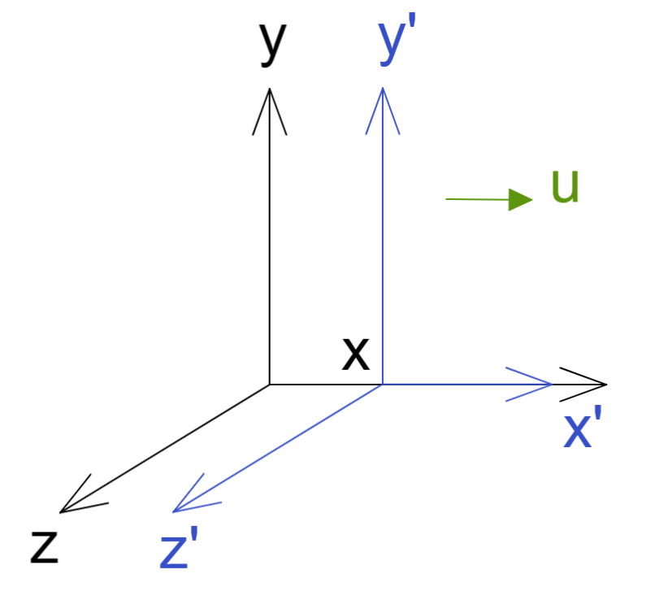
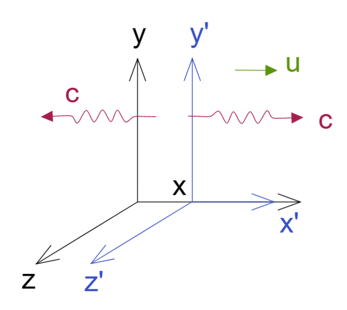
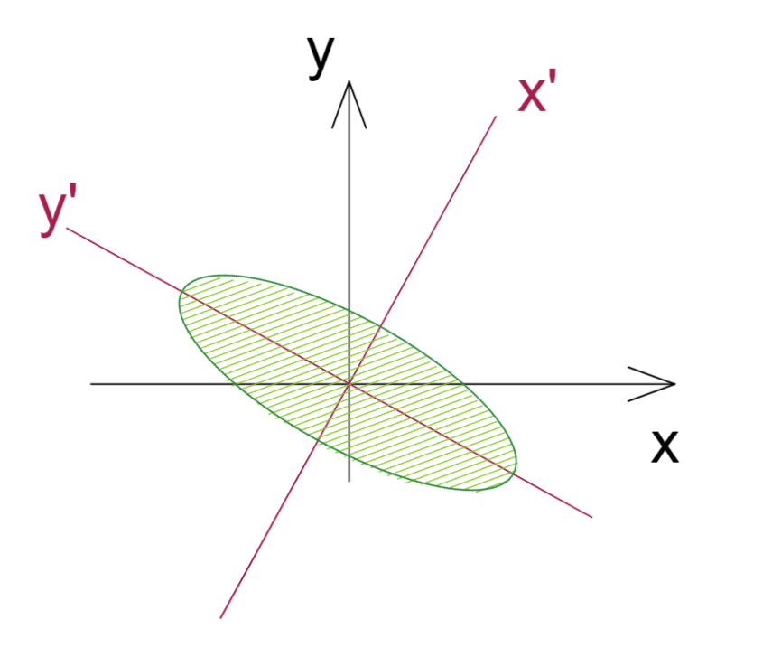
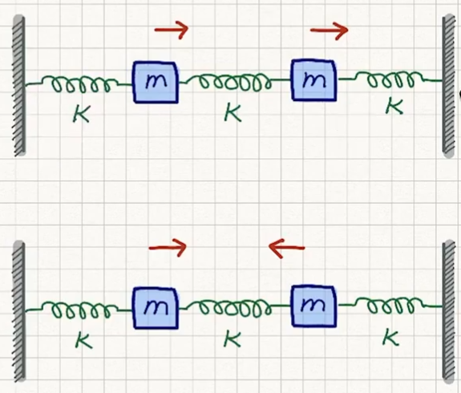

$$
R = 
\left (\begin{matrix}
a & b   \\
c & d   \\ 
\end {matrix}\right )
$$

[TOC]

  

$$
\sum\limits_i^m |\vec V_i\rang \lang \vec V_i| =I
$$

#### 构造原矩阵

我们可以根据本征向量$\vec V_i$  和本征值$\lambda$得到如下
$$
M = \sum\limits_i^m \lambda|\vec V_i\rang \lang \vec V_i|=\lambda I
$$

我们可以看出一个本征矩阵可以等同于 单位阵的翻倍；
可以使用已知的【本征向量$\vec V_i$】以及 【本征值$\lambda$】构建原矩阵；

证：

$M|v\rang 
=
\sum\limits_i^m \lambda|\vec V_i\rang \lang \vec V_i| v\rang
=
\lambda|v\rang (\sum\limits_i^m |\vec V_i\rang \lang \vec V_i|)
=
\lambda|v\rang$

证2：

对任意向量

$
|v\rang 
=
\sum\limits_i^m |\vec V_i\rang\lang \vec V_i|v\rang
= 
\sum\limits_i^m C_i|\vec V_i\rang 
\\
C_i = \lang \vec V_i|v\rang 表达为对基向量的投影结果系数$

当原本的矩阵作用在向量上

$M|v\rang 
=
\sum\limits_i^m M|\vec V_i\rang\lang \vec V_i|v\rang
=
\sum\limits_i^m \lambda|\vec V_i\rang\lang \vec V_i|v\rang
=
(\sum\limits_i^m \lambda|\vec V_i\rang \lang \vec V_i|) |v\rang
  $
所以可以得到 $M = \sum\limits_i^m \lambda|\vec V_i\rang \lang \vec V_i|$

------

将时间引入三维空间，得到四维线性空间；
$$
\left (\begin{matrix}ct' \\ x' \\ y' \\ z'  \end {matrix}\right )=  \left (\begin{matrix}\gamma & -\gamma\frac{u}{c} & 0 & 0  \\-\gamma\frac{u}{c}& \gamma  & 0 & 0  \\0 & 0 & 1 & 0  		\\0 & 0 & 0 & 1  		\\\end {matrix}\right )\left (\begin{matrix}ct  \\ x  \\ y  \\ z   \end {matrix}\right )\\\gamma = \frac{1}{\sqrt{1-(u/c)^2}}
$$
我们进行简化 去掉两个不影响的轴

洛伦兹转换 的向量空间 叫做 闵可夫斯基空间 ，这会导致可以使用三角表达矩阵中元素；

$\cosh \alpha=\gamma=\frac{1}{\sqrt{1-(u/c)^2}} $

$\sinh\alpha=\frac{\gamma u}{c}=\frac{u/c}{\sqrt{1-(u/c)^2}} $

$\cosh^2x-\sinh^2x=1$

那么上述变化简化为

-----

### 洛伦兹变换 详解

我们直接使用本章粗略讲解洛伦兹时候的简化式开始，
$$
\left (\begin{matrix}ct' \\ x' \end {matrix}\right )=  \left (\begin{matrix}\cosh\alpha  & -\sinh\alpha  \\-\sinh\alpha &  \cosh\alpha  \\\end {matrix}\right )\left (\begin{matrix}ct  \\ x  \end {matrix}\right )\\
$$
同时我们也设定了如下表达

$\cosh \alpha=\gamma=\frac{1}{\sqrt{1-(u/c)^2}} $

$\sinh\alpha=\frac{\gamma u}{c}=\frac{u/c}{\sqrt{1-(u/c)^2}} $

$\cosh^2x-\sinh^2x=1$

现在，我们开始对变换矩阵做对角化，行列式

$\left |\begin{matrix}
\cosh\alpha -\lambda  & -\sinh\alpha  \\
-\sinh\alpha &  \cosh\alpha -\lambda  \\
\end {matrix}\right |
=0
\Rightarrow 
(\lambda-\cosh\alpha)^2-\sinh^2\alpha
\Rightarrow 
\lambda_\pm=\cosh\alpha\pm\sinh\alpha$

由此开始求洛伦兹矩阵的本征向量

$\left (\begin{matrix}
\cosh\alpha  & -\sinh\alpha  \\
-\sinh\alpha &  \cosh\alpha  \\
\end {matrix}\right )
\left (\begin{matrix}
a  \\ 
b  \\
\end {matrix}\right ) 
=
\lambda_\pm
\left (\begin{matrix}
a  \\ 
b  \\
\end {matrix}\right )
\Rightarrow 
b= \mp a
\Rightarrow 
v_1 =\frac{1}{\sqrt{2}}
\left (\begin{matrix}
1  \\ 
-1  \\
\end {matrix}\right ),
v_2 =\frac{1}{\sqrt{2}}
\left (\begin{matrix}
1  \\ 
1  \\
\end {matrix}\right ) 
$

那么这些本征向量和本征值的物理意义是什么？

观察 a 和 b 的本征向量内的比例关系，可见其 x轴 和 时间 无论向前或向后运动比例都相同，
无论在何种坐标系观察有一个东西的速度总是不变，那么我们知道光速才有这个特性；

所以我们通过求得洛伦兹转换矩阵的本征向量获得了光速不变性的佐证   $x=\pm ct$

那么本征值是什么物理意义？我们定义一个光

$\omega = c k$

$\left (\begin{matrix}
\omega' \\ 
ck' \end {matrix}\right )
=  
\left (\begin{matrix}
\cosh\alpha  & -\sinh\alpha  \\
-\sinh\alpha &  \cosh\alpha  \\
\end {matrix}\right )
\left (\begin{matrix}
\omega    \\ 
ck  	\\
\end {matrix}\right )  
\\ $

$\left (\begin{matrix}
\omega' \\ 
\omega \end {matrix}\right )
=  
\left (\begin{matrix}
\cosh\alpha  & -\sinh\alpha  \\
-\sinh\alpha &  \cosh\alpha  \\
\end {matrix}\right )
\left (\begin{matrix}
\omega    \\ 
\omega   	\\
\end {matrix}\right )  
\\ $

$\omega'= (\cosh\alpha-\sinh\alpha)\omega
\rightarrow
\frac{\omega'}{\omega}=\cosh\alpha-\sinh\alpha   
$

由于我们上述的定义

$\frac{\omega'}{\omega}
=\frac{1}{\sqrt{1-(u/c)^2}} - \frac{u/c}{\sqrt{1-(u/c)^2}}
=\frac{1-u/c}{\sqrt{(1-u/c)(1+u/c)}} 
=\sqrt{\frac{1-u/c}{1+u/c}}
=\sqrt{\frac{c-u}{c+u}} 
< 1$

这里本征值表达就是光的多普勒效应
如果换一个对面的位置做观察，同样可以和上述类似步骤得到 $\sqrt{\frac{c+u}{c-u}} >1  $

------

### 矩阵对角化

首先并非所有矩阵都可以对角化，需要能够求出特征向量和特征值，且数量和其秩等同才行；

在一个正交空间A中有矩阵M，我们使用该空间自身的正交基表达这个矩阵，但该矩阵每个位置都有非0元素，而我们想要对其做简化；
于是我们将该矩阵M自身的一组特征向量和特征值求出（我简称 **特征库**，特征库包含了特征向量和特征值以及构建规则），再次计算该组**特征库**对空间A的正交基的各方面影响，即**特征库**中的特征向量替换为正交空间A基向量，此时就将矩阵M的特征向量影响去除，仅留下特征值影响，而特征值仅仅影响每个特定方向，故会出现非常规整的对角矩阵，由此完成对矩阵M的对角化简化；

其实我们可以假设一个M 为待定的**核心矩阵** ，其在不同正交基构成的空间中的表达不同；

$M_{ij}=\lang e_i| M | e_j\rang$   一组正交基构成空间A，两个基底表达为 I J  ，然后该核心矩阵在空间A中的表达如此，此时该表达是非解耦的；

核心矩阵使用自己的特征库表达出来，两个基底表达为 K W  ，（假设二维可按两个方向展开表达）；
所有正交基与自身转置外积之和为单位阵（或翻倍），注意这里的特征向量不一定是单位向量，但是建议将其单位化 

 $ M = \sum\limits_k c_k|\vec v_k\rang\lang \vec v_k| = \sum\limits_w c_w|\vec v_w\rang\lang \vec v_w|$

那么将核心矩阵的表达代入其在空间A的表达 ，即为 将特征库应用到A空间表达出来，核心矩阵特征向量最终消弭

$D_{ij}=\lang \vec v_i|M|\vec v_j\rang =
\lang \vec v_i|(\sum\limits_k c_k|\vec v_k\rang\lang \vec v_k|)|\vec v_j\rang =
\sum\limits_k c_k\lang \vec v_i|\vec v_k\rang\lang \vec v_k|\vec v_j\rang =
\sum\limits_k c_k\delta_{ik}\delta_{kj}  =
\sum\limits_k c_k\delta_{ij} \\
\rightarrow
D_{ij} =c_i\delta_{ij}=c_j\delta_{ij}$

此时我们得到了一个对角矩阵，整个对角上的数字即为核心矩阵M的各个特征值；

至此，将原有矩阵在空间A中解耦为对角矩阵，其实对角化方法可用简单的高斯消元法进行；

### 相似矩阵

例：

依旧使用矩阵
$
M_{ij} = \lang e_i|M|e_j \rang
=
\left (\begin{matrix}
5 & -2     \\
-2 & 2     \\ 
\end {matrix}\right )  $   

我们之前计算过其特征值为 $m=1,6$  
特征向量

$V_1=
\frac{1}{\sqrt{5}}
\left (\begin{matrix}
1     \\
2     \\ 
\end {matrix}\right ) ,m=1$
$V_2
=
\frac{1}{\sqrt{5}}
\left (\begin{matrix}
-2     \\
1     \\ 
\end {matrix}\right ) ,m=6
$

由上述对角化得到其对角矩阵为
$D_{ij} = \lang m_i|M|m_j\rang =
\left (\begin{matrix}
1 & 0     \\
0 & 6     \\ 
\end {matrix}\right )  $

虽然我们可以使用高斯消元法做对角化 ， 但我们这里使用狄拉克符号做计算；

我们看到两个正交基  的关系其实就是一个线性变换，这里由于同原点则可看作转动

$|m_j\rang=S|e_j\rang
\rightarrow
S_{ij}=\lang e_i|S|e_j\rang 
=
\lang e_i|m_j\rang$

接下来我们需要证明如下一个相似变换：
$$
S^{-1}MS=D
$$
证：

由于S变化是转动，那么其逆矩阵即为其转置矩阵  $S^{-1}=S^\top$

$
(S^{-1}MS)_{ij}
=
(S^{\top}MS)_{ij}
= 
\sum\limits_{kw} S^{\top}_{ik}  M_{kw}  S_{wj} 
=
\sum\limits_{kw} \lang m_i|e_k\rang   \lang e_k|M|e_w\rang \lang e_w|m_j\rang 
=
\lang m_i|M|m_j\rang = m_i\delta_{ij} = D_{ij}
$

该动作叫相似转换

### 对角矩阵应用

#### 对角矩阵的计算

$D_{ij} = d_i\delta_{ij}$

$D^2_{ij}=\sum\limits_k D_{ik}D_{kj}=\sum\limits_k d_i\delta_{ik}d_j\delta_{kj} = d_i^2\delta_{ij}
\rightarrow
(D^n)_{ij}=d_i^n\delta_{ij}$

也可从相似转换看到  $M=SDS^{-1}$

$M^n=M \cdot M \cdot M... = (SDS^{-1})(SDS^{-1})(SDS^{-1})...=S(D \cdot D \cdot D ...)S^{-1}=SD^nS^{-1}$

**可见对角矩阵相乘结果还是对角矩阵**

### 交换矩阵：

$[A,B]=AB-BA=0$

$(AB)_{ij}=\sum\limits_k a_i\delta_{ik}b_k\delta_{kj}=a_ib_i\delta_{ij}$

$(BA)_{ij}=\sum\limits_k b_i\delta_{ik}a_k\delta_{kj}=b_i a_i\delta_{ij}=a_ib_i\delta_{ij}$

也可从相似转换看到,若AB为可对角化的非对角矩阵，此时矩阵是一般的样子

$A'=SAS^{-1} \rightarrow A=S^{-1}A'S$

$B'=SBS^{-1} \rightarrow B=S^{-1}B'S$

$[A',B']=A'B'-B'A' \\=
SAS^{-1} \cdot SBS^{-1} - SBS^{-1} \cdot SAS^{-1} =
SABS^{-1} - SBAS^{-1} \\=
S(AB-BA)S^{-1}=S[A,B]S^{-1}=0$

如果两个矩阵使用相同的基底都可以对角化，那么这两者为交换矩阵，即便其表达方式不一定是对角化的；

#### 例 二次曲线

我们有公式来表达平面上的椭圆

$5x^2-4xy+2y^2=30$ 

也可以写为

$\left (\begin{matrix}
x & y    
\end {matrix}\right ) 
\left (\begin{matrix}
5 & -2     \\
-2 & 2     \\ 
\end {matrix}\right ) 
\left (\begin{matrix}
x   \\
y   \\ 
\end {matrix}\right )
=30 $

如果我们使用其对角矩阵来替换这个看起来一般的矩阵

$\left (\begin{matrix}
x' & y'    
\end {matrix}\right ) 
\left (\begin{matrix}
1 & 0     \\
0 & 6     \\ 
\end {matrix}\right ) 
\left (\begin{matrix}
x'   \\
y'   \\ 
\end {matrix}\right )
=30 
\rightarrow
x'^2+y'^2=30$

其表达就成了一个标准椭圆公式，只不过我们取的不是现有直角坐标系的基向量来表达；

#### 例：再提耦合振子

我们写出该模型的运动方程Equations Of Motion EOM；

$m\frac{d^2x_1}{dt^2}=-k_1x_1+k_{12}(x_2-x_1) \\ m\frac{d^2x_2}{dt^2}=-k_2x_2-k_{12}(x_2-x_1)$

将该式展开 可以拟出一个矩阵

$m \left (\begin{matrix}
\ddot x_1   \\
\ddot x_2   \\ 
\end {matrix}\right ) 
=
-\left (\begin{matrix}
k_1+k_{12} & -k_{12}   \\
-k_{12} & k_2+k_{12}    \\ 
\end {matrix}\right ) 
\left (\begin{matrix}
x_1   \\
x_2   \\ 
\end {matrix}\right )$

我们得到了一个对称的实数矩阵，那么如果此处的$k_{12}=0$ 那么两个物体的运动则充分解耦，其实也就是说中间弹簧不参与力的运算，即处于自然状态，那么其实就是两个物体运动方式一样；我们可是使用特征向量来证明；

为了简化 我们将所有的弹簧力取为K 即为 $K_1=K_2=K_{12}=K$

那么中间的振动矩阵就简化为如下

$IK=
\left (\begin{matrix}
2K & -K   \\
-K & 2K   \\ 
\end {matrix}\right ) $

我们求这个矩阵的特征值和特征向量

$IK=
\left |\begin{matrix}
2K & -K   \\
-K & 2K   \\ 
\end {matrix}\right |=0
\rightarrow
(\lambda-2K)^2-K^2=0 
\rightarrow
\lambda=K,3K$

$|K\rang = 
\frac{1}{\sqrt{2}}
\left (\begin{matrix}
1   \\
1   \\ 
\end {matrix}\right ) 
,
|3K\rang = 
\frac{1}{\sqrt{2}}
\left (\begin{matrix}
1   \\
-1   \\ 
\end {matrix}\right ) $

由此我们得到两个特征向量 以及两个特征值 ，
两个特征向量互不影响，那么就代表了该系统的两个特殊的振动，特殊振动中两个振子互不影响、互相独立，
这两个振动一个是上述的中间弹簧不参与力的运算的同相运动，还有一个就是同时相向并相离（相向）振动； 

同向振动时，频率为 $\omega_1 = \sqrt{\frac{K}{m}}$

相向振动时，频率为 $\omega_2 = \sqrt{\frac{3K}{m}}$

 

----

#### 例 生物演化应用：

现在我们再次回到导论中提到的，RNA演化问题；

我们先前讲不同碱基排列不同的RNA称为不同种RNA，或称物种，其实DNA排列不同的就是不同物种，所有RNA排列情况的集合就是所有生物物种的集合；
但是为了简化方程通常使用RNA作例子，模拟生物起源时期的地球原始汤中RNA的演化关系；

我们使用一个最常规的式子表达各种物种的**增长公式**：
$$
\frac{dN_i}{dt} = f_i N_i \\ f_i 为fitness物种适应度 \\ N_i为物种在所有物种中数量
$$
适应度会影响该物种的数量，所以这里的微分式就是表达未来该物种的种群数量发展潜力（发展力）；

当然也可以假设这里的适应度表达为出生率减去死亡率   $f_i=b_i-d_i$

这里的适应度是和各个物种数量以及发展时间有关的 我们写为  $f_i=f_i(N_1,N_2,...;t)$

那么为了考察某一物种在所有生物中的竞争力，需要将其表达为其数量在物种中的**占比公式**
$$
x_i \equiv N_i/N \\ N_i为某一物种数量 \\ N为生物总数
$$
那么显然

$ \sum\limits_i x_i=\frac{1}{N}\sum\limits_i N_i=1$

然写出复制基因等式 Replicator-Equation  ，我们对占比公式两边对时间微分，并将上述**增长公式**和**占比公式**带入：

$\frac{dx_i}{dt}=
\frac{d}{dt}(\frac{N_i}{N}) = 
\frac{1}{N}\frac{dN_i}{dt}-\frac{N_i}{N^2}\frac{dN}{dt} \\= 
\frac{1}{N}f_i N_i - \frac{N_i}{N^2} \sum\limits_j f_j N_j=
\frac{N_i}{N}f_i  - \frac{N_i}{N} \sum\limits_j f_j \frac{N_j}{N}\\=
f_i x_i  - x_i \sum\limits_j f_j x_j$

观察上述第二项的求和公式 ， $\sum\limits_j f_j x_j$  相当于所有物种各个适应度的加权平均，即生态系统平均适应度
我们将该平均适应度 写为  $\phi = \sum\limits_j f_j x_j$  ，于是得到**复制基因等式** Replicator-Equation：
$$
\frac{d x_i}{dt}=( f_i -\phi )x_i
$$
我们要注意这里涉及的某物种占比 $x_i$ 和某物种适应性 $f_i$ 和其他物种生物都相关，就算物种数量遵循自然指数增长方式，由于占比的分母也会同时出现综合变动，适应性则会受到变异扰动，故会呈现较为复杂的非线性；

##### 零和游戏 zero-sum-game

当平均适应度为0的时候，即  $\phi=0$  ，生态系统处于彻底的稳态 ，那么所有物种总量对时间微分：

$\frac{dN}{dt} = \sum\limits_i \frac{dN_i}{dt} =
\sum\limits_i f_i N_i = ( \sum\limits_i f_i x_i)N =
\phi N $

那么此时生物数量恒定，这个零点在数值模拟时作为基本参照很有用；

##### 适应度地形  fitness-landscape

依旧使用我们在导论中提到的 嘌呤 和 嘧啶 的碱基对组RNA链来表达不同的物种
假设链条长度固定为 L    ， 0 和 1 表达 嘌呤 和 嘧啶 的区别  ，对这种排列可能性进行列举：

原始种为    000000   具有适应度   $f_0$

变异种为    010010   具有适应度   $f_i,i=1,2,...,2^L-1$

指定不同种之间互相变异的汉明距离 $d_{ij}$ ， 表示从一个种变异到另一个种的变化量用距离表示 
这里的汉明距离是计算机术语，由于已经将RNA链条表达为二进制，所以可简化为汉明距离 
且两个种之间互相的变化是相同的  $d_{ij} = d_{ji}$  （注意这里已经将矩阵的对称性引入，导致后续对角化的可能）其实也就是碱基变异数；
我们不仅计算变异可能性也计算不变异位置的可能性，根据古典概率，互斥事件同时发生的概率为两者各自概率相乘；

我们由此可以得到**基因变异矩阵** ：
$$
m_{ij} = u^{d_{ij}}(1-u)^{L-d_{ij}}  \\ u为碱基改变可能性，即变异可能性 \\ 1-u 为碱基不变可能性，即复制可能性
$$
可见变异距离越远，达成的总可能越低
该矩阵包含了所有不同种类之间变异的可能性，相当于一个变异几率表，由于互变距离和可能性一样，变异矩阵是对称矩阵；

此时我们可给出适应度地形如图；

##### 准物种  quasi-species

由于变异存在，那么一个物种可能会变异称为相近的物种，那么就无法算入原本物种数量中，而算入变异结果的那个物种，其缘由在于变异导致的物种占比变化，进而造成了平均适应度的扰动
上述我们给出的**复制基因等式**不再是零和游戏，那么 算上 $平均适应度\phi$ 修正的**复制基因等式**，同时算上所有物种变异到当前物种的**基因变异矩阵**（变异可能性表），**复制基因等式**改写为**准物种等式**（相近物种等式）：
$$
\frac{d x_i}{dt}=\sum\limits_j m_{ij} f_j x_j -\phi x_i
$$
这里是假设**当前物种i** ，使用**变异矩阵**修正由其他序列变异而来包括自身序列变异失去的物种数量；
该式子其实为了消除平均适应度的求和项而设立；

##### 量子化推导

至此然后的操作需要一 点想象力 ，借由量子力学的规范变换(Gauge transformation)得到如下
假设一个**生态系统发展潜力表达式**，其内部含有指数增长、增长修正、适应度、占比，这里的根号是为了推导方便：

$\Psi(t)=\sqrt{f_i}\cdot x_i(t)e^{w(t)} , w'(t)=\frac{dw}{dt}=\phi(t)$

两边微分，并将**准物种等式**带入

$\frac{d\Psi_i}{dt}
=
\sqrt{f_i}(\frac{dx_i}{dt}e^w+x_i\frac{dw}{dt}e^w)
=
\sqrt{f_i}(\sum\limits_j m_{ij} f_j x_j e^w -\phi x_i e^w+x_i\phi e^w) 
=
\sqrt{f_i}(\sum\limits_j m_{ij} f_j x_j e^w )
\\ \rightarrow
\frac{d\Psi_i}{dt} = \sqrt{f_i}(\sum\limits_j m_{ij} f_j x_j e^w )
$

$\rightarrow  
\frac{d\Psi_i}{dt} 
=
\sqrt{f_i}(\sum\limits_j m_{ij}\sqrt{f_j} \sqrt{f_j} x_j e^w )
=
\sqrt{f_i}(\sum\limits_j m_{ij}\sqrt{f_j} \Psi_j )  
=
 \sum\limits_j \sqrt{f_if_j} m_{ij} \Psi_j \\  
\rightarrow  
\frac{d\Psi_i}{dt} = \sum\limits_j \sqrt{f_if_j} m_{ij} \Psi_j   $

引入一个**汉密尔顿矩阵** $H_{ij}$，该矩阵是个对称矩阵，有非常良好的性质

$H_{ij} = -\sqrt{f_if_j}m_{ij} , H_{ij} =H_{ji}$ 

于是得到一个优雅的公式，物种发展潜力对时间的微分表达式，由此将生物动力学和物理动力学联系起来；
$$
\frac{d\Psi_i}{dt} =- \sum\limits_j  H_{ij} \Psi_j
$$
而一个对称矩阵可以计算得到其特征值以及特征向量；
于是假设**汉密尔顿矩阵**的 特征向量为 $|E_\alpha\rang ,\alpha=0,1,2,...2^L-1$  
**汉密尔顿矩阵**特征值设为 $\lambda_\alpha$
如果 $|\Psi(t)\rang$是一个**汉密尔顿矩阵**的本征状态 

$\frac{d|\Psi\rang}{dt}=-H|\Psi\rang=-\lambda_\alpha|\Psi\rang$

可以两边积分

$|\Psi(t)\rang =|\Psi(0)\rang e^{-\lambda_\alpha t} = e^{-\lambda_\alpha t}|E_\alpha\rang $

引入单位阵

$|\Psi(0)\rang =\sum\limits_\alpha |E_\alpha\rang\lang E_\alpha |\Psi(0)\rang = \sum\limits_\alpha C_\alpha | E_\alpha\rang $

所以
$$
|\Psi(0)\rang = \sum\limits_\alpha C_\alpha | E_\alpha\rang \\ 										|\Psi(t)\rang = \sum\limits_\alpha C_\alpha e^{-\lambda_\alpha t}| E_\alpha\rang  								\\ C_\alpha代表某常数																						 \\ e^{-E_\alpha t}代表了随时间的衰退修正
$$
当长时间演化，观察0号状态，最后必定留下一个基态

$|\Psi_0(t)\rang \sim C_0 e^{-\lambda_0 t}| E_0\rang  			$

故最终由特征向量进行决定了物种分布的状态，也就是将复杂的问题整定为对矩阵求特征向量问题；

我们再看上文 **生态系统发展潜力表达式** ， 移动一下位置

$x_i = \frac{1}{\sqrt{f_i}}\Psi_ie^{-w(t)}$

两边求和

$1=\sum\limits_i x_i =\sum\limits_i( \frac{\Psi_i}{\sqrt{f_i}}) e^{-w} =1
\rightarrow
e^w=\sum\limits_i\frac{\Psi_i}{\sqrt{f_i}}$

由此得到物种的**占比公式**
$$
x_i =\frac{ \frac{\Psi_i}{\sqrt{f_i}}}{\sum\limits_j\frac{\Psi_j}{\sqrt{f_j}}}
$$
此时可以涉及计算程序进行考察

这里给出错误临界  $u_c L=\ln(\frac{f_P}{f})$

其实呢，根据考察能够得到
 $u<1/L$  时候会在物种空间出现高原或高峰，代表出现了优势物种占据生态系统的多数
 $u>1/L$  时候物种空间个物种数量大体平均 ，代表出现了没有个别组的物种占据生态系统的多数

可见突变几率过大会导致无法出现高级动物；

参考资料  Evolutionary Dynamics by M-A-Nowak

