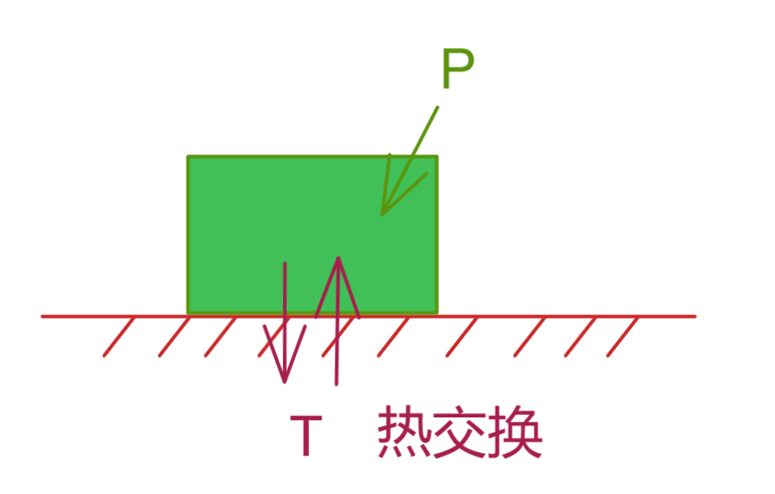
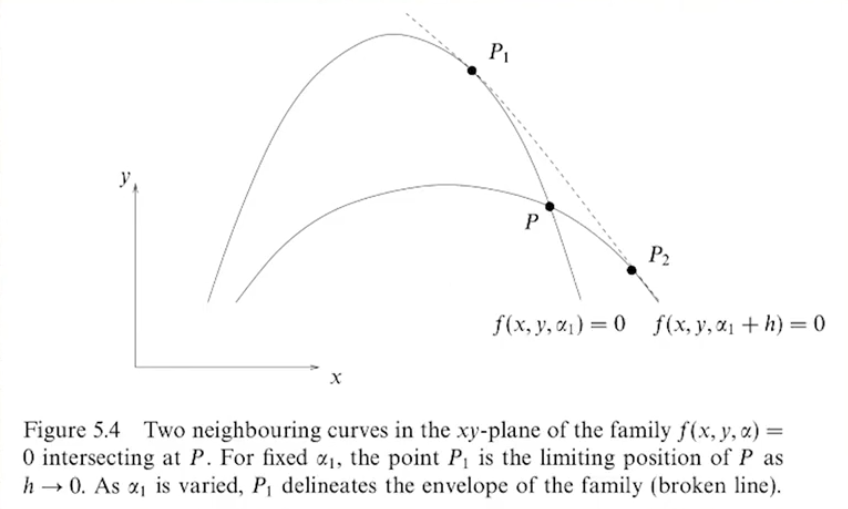
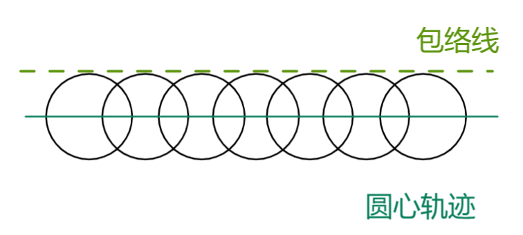
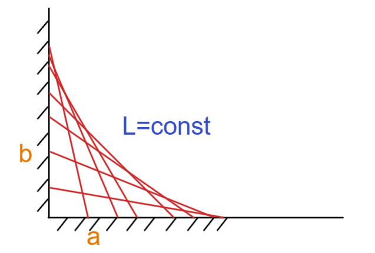
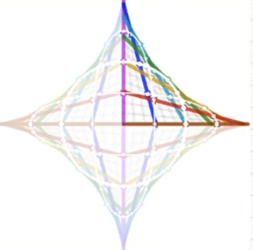
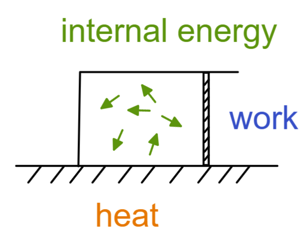

[TOC]

 

我们在寻找驻点的时候只要能够对函数微分即可

$df =0 $

如果没有任何constraint约束条件（边界条件）就可以如下梯度方式表达

$df = \vec\nabla f\cdot d\vec r, d\vec r 任意微向量 \rightarrow \vec\nabla f = 0 $

如果带有边界条件的时候  如 $\Phi(x_i)=0$  该约束可扩展到多维空间，特殊情况三维空间为 $\Phi(x,y)=0$ 是曲面；

如果我们对约束条件两边微分得到 $d\Phi=\vec\nabla\Phi\cdot d\vec r =0,d\vec r必须在曲面内$ ，那么由此关系得到$d\vec r$必然垂直于$\vec\nabla\Phi$

那么微分向量受到约束，回到函数$df$ ，就可以得到

 $df = \vec\nabla f\cdot d\vec r, d\vec r \in \Phi , d\vec r \bot \vec\nabla\Phi \rightarrow \vec\nabla f + \lambda\vec\nabla\Phi= 0 $

即  原函数和约束条件函数的梯度平行 

### 物理应用

--------------------------------------------

### 香农熵 信息熵   Shannon entropy

对信息的量化方法

从古典概率开始,抛硬币记录概率

| 硬币 | 符号 | 几率      |
| ---- | ---- | --------- |
| 正   | X=1  | $P_1=P$   |
| 反   | X=0  | $P_0=1-P$ |

$P_1+P_0 =1$

如果要看一个事件发生的不确定性如何香农提出了如下公式，对几率倒数的对数取期望值

$\sigma = <\ln\frac{1}{P}> = \sum\limits_\alpha P_\alpha\ln\frac{1}{P_\alpha}=- \sum\limits_\alpha P_\alpha\ln P_\alpha$

也常常写为
$$
H(x)\equiv-\sum\limits_x P(x)\ln[P(x)]
$$

该公式常用于近代热统计物理以及计算机基础原理；

> 这里我们需要详细解释一下
>
> 信息熵往往是为了表达一个系统不确定性，系统的不确定性越大，熵也就越大，把它搞清楚所需要的信息量也就越大;
>
> 古典概率中一个情况（变量）的概率值表达为一个确定性（不确定性），只要得到概率值那么改变量在系统中的**确定性**和**不确定性**同时被决定，所以可以说此时**确定性**和**不确定性**在系统中同一，如果一个系统只有两个变量，那么其不确定性（确定性）就是两个变量不确定性（确定性）的和，如果需要使用**确定性**几率来表达这个**不确定性**的和的关系，那么就采用一个倒数形式先做出**不确定性**和**确定性**的反比关系，然后取得对数来对反比关系添加可加性，那么有了$f(P)=\log\frac{1}{P} = -\log P$ ，$f(P)$ 就是某个变量的不确定性，如果是两个变量，则有 $f(P_1)+f(P_0)=-\log P_1-\log P_0=-\log(P1P0)=\log\frac{1}{P_1P_0}=f(P_1P_0)$
>
> 可见该结果符合以往两个情况同时出现需要将概率相乘的常识认知，对两个情况同时出现的状况取不确定性=两个情况的不确定性之和 ，可见该公式符合上述对于确定性和不确定性的要求；
>
> 如果我们有多个变量，要计算其不确定性，那么只需将每个变量的不确定性和其出现概率都计算，然后统计平均，即取期望值即可；所以有了上述香农熵公式；
>
> 注：对数的底数一般为2 10 或 e ，现代计算机的二进制导致其基本的计算底数取得2，不过可以根据后续图像直观推测e的效率最高，越2.7，更加接近3，所以理论上三进制计算机处理信息更加高效；

### 热平衡熵

熵在热力系统中总会达到最高点

我们看一个例子

#### 例1 孤立热力系统

在一个孤立系统中，系统有共N个等概率状态，如果其最后达到热平衡，计算其香农熵；

根据上述说法，首先拿出香农熵公式   $\sigma=- \sum\limits^N_{\alpha=1} P_\alpha\ln P_\alpha$

同时添加约束条件，即整个系统为孤立，那么所有状态概率和为1，那么 $ \sum\limits^N_{\alpha=1} P_\alpha = 1$

既然有了约束条件，并要求我们求系统熵达到最高的极值，此时我们使用拉格朗日乘子法：

$\sigma^*=\sigma+\lambda(\sum\limits^N_{\alpha=1} P_\alpha -1)$

$\frac{\part \sigma^*}{\part P_i}=0 \rightarrow -\ln P_i-P_i\frac{1}{P_i}+\lambda=0 \rightarrow -\ln P_i-1+\lambda=0$

$P_i = e^{\lambda-1}=const$

由于 总概率为1 ，则$ \sum\limits^N_{\alpha=1} P_\alpha = P_i\cdot N = 1 $

所以$P_i = \frac{1}{N}$

孤立系统在达到最后平衡时，每个状态出现的几率应该相同；

所以 $\sigma=- \sum\limits^N_{\alpha=1} P_\alpha\ln P_\alpha=-\frac{1}{N}\ln\frac{1}{N}\times N = \ln\frac{1}{N}=\ln N$

在热统计物理中，玻尔兹曼熵 = 玻尔兹曼常数 * 最大香农熵  

$S = k\cdot \sigma_\max ，k=1.380649×10^{-23}J/K$

香农熵和玻尔兹曼熵是等价的，所以两者的物理状态理论同构；

于是人们分别从物理现象和数学概率中发现了相同的理论结构；

#### 例2 可换热系统

系统总体的具有一个内能U，且上下可交换热量，求该最大信息熵；

总状态和为1 则 $ \sum\limits^N_{\alpha=1} P_\alpha = 1$

总内能为U，则  $ \sum\limits^N_\alpha P_\alpha E_\alpha=U$

得到两个边界条件

此时我们需要利用拉格朗日乘子法

$\sigma^* = \sigma +\lambda_1(\sum\limits^N_{\alpha=1} P_\alpha - 1)+\lambda_2(\sum\limits^N_\alpha P_\alpha E_\alpha-U) $

$\frac{\part \sigma^*}{\part P_i}=0 \rightarrow -\ln P_i - P_i\frac{1}{P_i}+\lambda_1+\lambda_2E_i=0 \rightarrow P_i=e^{\lambda_1-1}e^{\lambda_2E_i}$

代回边界条件 $ \sum\limits^N_{\alpha=1} P_\alpha = 1$

$\sum\limits_\alpha P_\alpha=e^{\lambda_1-1}(\sum\limits_\alpha e^{\lambda_2E_\alpha })=1\rightarrow P_i=\frac{ e^{\lambda_2E_i}}{\sum\limits_\alpha e^{\lambda_2E_\alpha }}$

热力学内发现  $\lambda_2=-\frac{1}{kT}$ 

则导致上述公式成为 $P_i=\frac{ e^{\lambda_2E_i}}{\sum\limits_\alpha e^{\lambda_2E_\alpha }} = \frac{1}{Z}e^{-\frac{E_i}{kT}} \rightarrow Z = \sum\limits_\alpha e^{-\frac{E_\alpha}{kT}}$

然后我们得到了波兹曼分布
$$
Z = \sum\limits_\alpha e^{-\frac{E_\alpha}{kT}} \\
P(E_i)= \frac{1}{Z} e^{-\frac{E_\alpha}{kT}}
$$
其解释了高能量状态非常罕见；

得到了在不同宏观能级情况下的研究可忽略微观干扰的数学依据；因为微观干扰宏观的高能级状态在概率上不为0但是小到几乎不可能发生；

### 包络线问题

一个受到参数变化的函数集合所构成的包络线；

我们见到整个包络线的非常相近的两点，也在非常相似的两个函数的图像上，那么得到关系：

$f(x,y;\alpha) =0,f(x,y;\alpha+d\alpha) =0$

写出展开式：

$f(x,y;\alpha+d\alpha) = f(x,y;\alpha)+\frac{\part f}{\part\alpha}d\alpha,f(x,y;\alpha)=0 \rightarrow \frac{\part f}{\part\alpha}=0$

于是得到方程组
$$
f(x,y;\alpha) = 0,\frac{\part f}{\part\alpha}(x,y;\alpha)=0
$$
那么只需要解方程消去变化参数，即可得到由原函数变化形成的包络线

#### 例1 运动波

我们由一系列的圆 符合方程 $(x-\alpha)^2+y^2=\epsilon^2$

我们得到原函数以及其微分

$f(x,y;\alpha)=(x-\alpha)^2+y^2-\epsilon^2=0$

$\frac{\part f}{\part\alpha} = 0 \rightarrow -2(x-\alpha)=0$

那么将 $x=\alpha$代入上述原函数以及其微分式既可以消去 $\alpha$ 

$y=\pm \epsilon$

可见和图中得到的结果符合；

例2 滑梯

根据模型我们得到方程集合 $\frac{x}{a}+\frac{y}{b}=1$

约束条件为 $a^2+b^2=L^2$

我们为了将两个参量a b 化为一个参量 采用三角函数参数化表达

$a=L\cos\theta,b=L\sin\theta \rightarrow \frac{x}{L\cos\theta}+\frac{y}{L\sin\theta}=1$

$f(x,y;\theta)=\frac{x}{L\cos\theta}+\frac{y}{L\sin\theta}-1=0$

$\part f_\theta=\frac{x\sin\theta}{L\cos^2\theta}+\frac{y\cos\theta}{L\sin^2\theta} =0 \rightarrow  \frac{x}{y}=\frac{\cos^3\theta}{\sin^3\theta}$

所以解得 $x=C\cdot\cos^3\theta,y=C\cdot\sin^3\theta$

代回$\frac{x}{L\cos\theta}+\frac{y}{L\sin\theta}=1$ 得到 $C=L$ 得到

$x=L\cdot\cos^3\theta,y=L\cdot\sin^3\theta \rightarrow (\frac{x}{L})^\frac{1}{3}=\cos\theta,(\frac{y}{L})^\frac{1}{3}=\sin\theta$

代回$\frac{x}{L\cos\theta}+\frac{y}{L\sin\theta}=1$ 得到结果

$(\frac{x}{L})^\frac{2}{3}+(\frac{y}{L})^\frac{2}{3}=1$

实际包络线如上，其实延拓到其他象限就是著名得Asteroid星型线；

#### 例3 理想气体

这里有个理想气体受热并做功，吸热-做功=当前内能

$dU = TdS -PdV$ 也就是说得到一个函数 $U=U(S,V)$

我们对函数$U=U(S,V)$进行微分

$dU=(\frac{U}{S})_VdS+(\frac{U}{V})_SdV$

我们经过比对 $dU = TdS -PdV$ 和 $dU=(\frac{\part U}{\part S})_VdS+(\frac{\part U}{\part V})_SdV$   得到了 

$ T=(\frac{\part U}{\part S})_V ,P=-(\frac{\part U}{\part V})_S$

由于二次偏导性质 $\frac{\part^2U}{\part V\part S} = \frac{\part^2U}{\part S\part V} \rightarrow \frac{\part }{\part V}(\frac{\part U}{\part S})=\frac{\part }{\part S}(\frac{\part U}{\part V})$
$$
-(\frac{\part P}{\part S})_V=(\frac{\part T}{\part V})_S
$$

