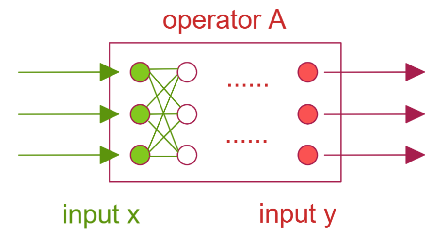

$$
R = 
\left (\begin{matrix}
a & b   \\
c & d   \\ 
\end {matrix}\right )
$$

[TOC]

### 矩阵

$|y\rangle = A | x \rangle \rightarrow \sum\limits_j A_{ij} x_j = y_i $
$$
A_{ij}=\langle \hat e_i | A | \hat e_j \rangle
$$
该公式即为 一个矩阵 对两个基向量分别做投影，仅保留这两个基向量在矩阵内产生的影响值，以确定矩阵该处的元素值；

狄拉克符号  bra & ket

$|a\rangle = \sum\limits_{i=1}^{N}a_i  | \hat e_i \rangle $       ，ket ， 竖向量

$ \langle a| = \sum\limits_{i=1}^{N}  \langle\hat e_i | a_i^* $      ，bra， 横向量

内积 

$\langle x| y \rangle = \sum\limits_ix_i^* y_i \ , \  \langle y|x \rangle = \sum\limits_i y_i^* x_i = \langle x|y \rangle ^*$

### 矩阵规则

$$
(A+B)_{ij} = A_{ij} + B_{ij} \\ 
(\lambda A)_{ij}=\lambda A_{ij} \\
(AB)_{ij} = \sum\limits_k A_{ik}B{kj}
$$

#### 例1 三维空间转动

有向量 $\vec v$

$ R_z(\theta)\vec v = \vec v'$

$v_x' = v_x\cos\theta -v_y\sin\theta$

$v_y' = v_x\sin\theta +v_y\cos\theta$

$v_z' =v_z  $

我们可以将其写为矩阵
$$
\left (\begin{matrix}
v_x' \\ v_y' \\ v_z'  
\end {matrix}\right )
=  
\left (\begin{matrix}
\cos\theta & -\sin\theta & 0   \\
\sin\theta & \cos\theta  & 0   \\
0 & 0 & 1  		\\ 
\end {matrix}\right )
\left (\begin{matrix}
 v_x  \\ v_y  \\ v_z   
\end {matrix}\right )
$$
我们开始考察基向量旋转的情况

可见

$\hat i' = \cos\theta\hat i+\sin\theta\hat j$ 

$\left (\begin{matrix}
i_x' \\ i_y' \\ i_z'  
\end {matrix}\right )
=  
\left (\begin{matrix}
\cos\theta &  [] & []   \\
\sin\theta &  [] &  []  \\
0 & []  &  [] \\ 
\end {matrix}\right )
\left (\begin{matrix}
1  \\ 0  \\ 0   
\end {matrix}\right )$

针对其他基向量也是一样的操作，

那么最后就能够将中间的矩阵构建出来

那么沿着三个轴旋转的矩阵就能够得到
$$
R_z(\theta)
=  
\left (\begin{matrix}
\cos\theta & -\sin\theta & 0   \\
\sin\theta & \cos\theta  & 0   \\
0 & 0 & 1  		\\ 
\end {matrix}\right ) \\
R_x(\theta)
=  
\left (\begin{matrix}
1  & 0 &  0	\\ 
0 & \cos\theta & -\sin\theta \\
0 & \sin\theta & \cos\theta  \\
\end {matrix}\right )\\
R_y(\theta)
=  
\left (\begin{matrix}
\cos\theta& 0 &  \sin\theta    \\
0 & 1 & 0  		\\ 
-\sin\theta& 0 & \cos\theta     \\
\end {matrix}\right )
$$

>  定义 交换子 commutator
>
> $[A,B]\equiv AB-BA$

我们构造一个交换子式子，该式表达为 【绕x转转动】 【绕y轴转动】  两个动作先后不同导致的结果是否一样？

$[R_x,R_y] =R_x R_y-R_y R_x $ 

直接将旋转90度带入上述旋转式子即可证明，旋转动作的先后会导致结果不同；

所以 

$[R_x,R_y] =R_x R_y-R_y R_x \neq 0 $ 

### 矩阵转置

转置简单表现为将一个矩阵 行列互换

$(A^\top)_{ij} = A_{ji}$

#### 例 

$R_z(\theta)
=  
\left (\begin{matrix}
\cos\theta & -\sin\theta & 0   \\
\sin\theta & \cos\theta  & 0   \\
0 & 0 & 1  		\\ 
\end {matrix}\right ) \\
R_z^\top(\theta)
=  
\left (\begin{matrix}
\cos\theta & \sin\theta & 0   \\
-\sin\theta & \cos\theta  & 0   \\
0 & 0 & 1  		\\ 
\end {matrix}\right ) \\$

$(R^\top)_{ij} = R_{ji}$

把它们乘起来

$R_z(\theta)R_z^\top(\theta)
=  
\left (\begin{matrix}
\cos\theta & -\sin\theta & 0   \\
\sin\theta & \cos\theta  & 0   \\
0 & 0 & 1  		\\ 
\end {matrix}\right )
\left (\begin{matrix}
\cos\theta & \sin\theta & 0   \\
-\sin\theta & \cos\theta  & 0   \\
0 & 0 & 1  		\\ 
\end {matrix}\right ) 
=  
\left (\begin{matrix}
1 & 0 & 0   \\
0 & 1 & 0   \\
0 & 0 & 1   \\ 
\end {matrix}\right ) = \delta_{ij} $

### 正交矩阵

定义为 ，和自己的转置相乘的结果为单位阵

$R_z R_z^\top =\delta_{ij} =\mathbf{1} $

### 赫尔米特共轭 / 厄米共轭

当矩阵运算中带有复数的时候，变换后需进行厄米共轭 ，匕首dagger 符号即为 共轭并转置

$(A^\dagger)_{ij}=A^*_{ji}$  也就是 $ A^\dagger  = (A^*)^\top $ $ A^\dagger  = (A^\top )^*$

若整个矩阵为实数矩阵 ，那么其厄米共轭的结果和dagger结果一样

$A_{real}^* = A_{real}^\dagger$

例 
$$
(AB)^\dagger =B^\dagger A^\dagger
$$
$[(AB)^\dagger]_{ij} = (AB)^* _{ji} = \sum\limits_kA_{jk}^*B_{ki}^* = \sum\limits_k(A^\dagger)_{kj}(B^\dagger)_{ik}= \sum\limits_k(B^\dagger)_{ik}(A^\dagger)_{kj}=(B^\dagger A^\dagger)_{ij}$

同样的证明方法用在实数矩阵上就证明 $(AB)^\top =B^\top A^\top $

--------

### 矩阵的迹 Trace

方阵的迹定义为 对角线元素的和

$TrA=\sum\limits_i^N A_{ii} = A_{11}+A_{22}+...+A_{NN}$

当我们有三个矩阵 对其乘积求迹

$Tr(ABC) = \sum\limits_i(ABC)_{ii}=\sum\limits_{ijk}A_{ij}B_{jk}C_{ki}=\sum\limits_{ijk}B_{jk}C_{ki}A_{ij}=\sum\limits_j(BCA)_{jj}=Tr(BCA)$

同理证得

$Tr(ABC)=Tr(CAB)=Tr(BCA)$

这个顺序是轮换形式，故  $Tr(CBA) $ 是不在上述等式中的

### 行列式Determinant

行列式背后具有列维-奇维塔张量定义 内容较为复杂 后期会讲

$detA=|A| =  
\left |\begin{matrix}
A_{11} & A_{12} & A_{13}   \\ 
A_{21} & A_{22} & A_{23}   \\ 
A_{31} & A_{32} & A_{33}   \\ 
\end {matrix}\right | \\  =   
(A_{11}A_{22}A_{33}+A_{12}A_{23}A_{31}+A_{13}A_{21}A_{32})-(A_{13}A_{22}A_{31}+A_{12}A_{21}A_{33}+A_{11}A_{23}A_{32}) $

其正负的判定总结为

$(123),(231),(312) + \\ (132),(213),(321)  -$

即可写为   $(-1)^P$ P为该序列回到 123 顺序时 需要交换位置的次数（每次都是两个互换）

如 

$(231) \rightarrow (132) \rightarrow (123) \ \  P = 2 为偶数 $

$(321) \rightarrow (123) \ 1，3互换一次即可 \     P=1 为奇数 $

N阶矩阵行列式展开后会有 $N!$ 个子项

### 行列式的简单定义

$detA = \sum\limits_{perm}(-1)^P A_{1P_1}A_{2P_2}A_{3P_3} \\ (P_1P_2P_3) = (123),(312),...$

如果据某行或者某列进行展开的就是拉普拉斯展开

对每个元素展开所得到的降维行列式在高中教材称之为代数余子式

$detA = A_{11}C_{11}+A_{12}C_{12}+A_{13}C_{13}$

$C_{ij}=(-1)^{i+j}M_{ij}$

$C_{11} =(-1)^{1+1} =  
\left |\begin{matrix}
A_{22} & A_{23} \\ 
A_{32} & A_{33} \\  
\end {matrix}\right | \\$

$C_{12} =(-1)^{1+2} =  
\left |\begin{matrix}
A_{21} & A_{23} \\ 
A_{31} & A_{33} \\  
\end {matrix}\right | \\$

#### 例 三维转动的拉普拉斯展开

$|R_z(\theta)|
=  
\left |\begin{matrix}
\cos\theta & -\sin\theta & 0   \\
\sin\theta & \cos\theta  & 0   \\
0 & 0 & 1  		\\ 
\end {matrix}\right |   
=  
0-0+  
\left |\begin{matrix}
\cos\theta & -\sin\theta    \\
\sin\theta & \cos\theta     \\ 
\end {matrix}\right | 
=\cos^2\theta-(-\sin^2\theta)=1$

一个向量在空间中转动的时候其长度不变

### 行列式性质

##### 1 无论是否转置 方阵的行列式结果不变

$|A^\top|=|A|$

证：

$detA = \sum\limits_{perm}(-1)^P A_{1P_1}A_{2P_2}A_{3P_3} =detA = \sum\limits_{perm}(-1)^Q A_{Q_11}A_{Q_22}A_{Q_33} $

##### 2 共轭并转置的情况

$|A^\dagger|  = |A|^* $

证：

$|A^\dagger|=|(A^*)^\top|=|A^*|=|A|^*$

##### 3 行之间互换 或者 列之间互换

$|A|=-|A'|$

证：

$detA'=\sum\limits_{perm}(-1)^P A'_{1P'_1}A'_{2P'_2}A'_{3P'_3}=\sum\limits_{perm}(-1)^P A'_{1P'_1}A'_{3P'_2}A'_{2P'_3}=\sum\limits_{perm}(-1)^P A'_{1P'_1}A'_{2P'_3}A'_{3P'_2}$

由于  正负判定交换一次需要变换正负   $(P_1P_3P_2) = -(P_1P_2P_3)$

$\sum\limits_{perm}(-1)^P A'_{1P'_1}A'_{2P'_3}A'_{3P'_2} =- \sum\limits_{perm}(-1)^P A'_{1P'_1}A'_{2P'_2}A'_{3P'_3} = -detA = detA'$

##### 4 乘积

$|\lambda A| = \lambda^N|A| $

##### 5 行之间或列之间有相同的 那么结果为 0

$if \ A_{i.}=A_{j.} \ or \ A_{.i}=A_{.j} \,then \ |A|=0$

##### 6 将某行翻倍加到另一行上 结果不变  (列之间也一样)

$ 
\left |\begin{matrix}
a & b \\ 
c & d \\  
\end {matrix}\right | =  
\left |\begin{matrix}
a+\lambda b & b \\ 
c+\lambda d & d \\  
\end {matrix}\right | $

##### 7 分配

$|AB|=|A||B|$

$|AB...Z|=|A||B|...|Z|$

### 逆矩阵

常用式

$A|x\rangle = |y\rangle$

是否可以找出一个反作用的矩阵 从答案寻求源头呢

$A^{-1}|y\rangle = |x\rangle$；

并非所有矩阵都有逆矩阵，就是说具有不可逆的线性操作
其实就是有些操作会消弭被操作数据的特征，导致逆操作无法讲原有数据的特征和细节还原出来；

#### 逆矩阵存在判定

如果操作为线性的，那么求逆矩阵只需要满足  $detA\neq 0$ 即可

$detA\neq 0  $   称为  non-singular  matrix

$detA = 0 $   称为  singular  matrix

 non-singular  matrix  存在逆矩阵

$A^{-1}|y\rangle = |x\rangle \rightarrow A^{-1}A|x\rangle = |x\rangle \rightarrow A^{-1}A=\mathbf{1}$

$A |x\rangle = |y\rangle \rightarrow A A^{-1}|y\rangle = |y\rangle \rightarrow AA^{-1}=\mathbf{1}$

#### 逆矩阵计算方法

$$
(A^{-1})_{ij}=\frac{1}{|A|}c_{ji} \\ c_{ij}=(-1)^{i+j}M_{ij}
$$

#### 例 旋转矩阵的逆矩阵

$R_z(\theta)
=  
\left (\begin{matrix}
\cos\theta & -\sin\theta & 0   \\
\sin\theta & \cos\theta  & 0   \\
0 & 0 & 1  		\\ 
\end {matrix}\right )   
   $

$R^{-1}_{11}
=  (-1)^{1+1}
\left |\begin{matrix}
\cos\theta & 0    \\
0 & 1     \\ 
\end {matrix}\right |   = \cos\theta
 $

$R^{-1}_{12}
=  (-1)^{1+2}
\left |\begin{matrix}
-\sin\theta & 0    \\
0 & 1     \\ 
\end {matrix}\right |   = \sin\theta
 $

$R^{-1}
=  
\left (\begin{matrix}
\cos\theta &  \sin\theta & 0   \\
-\sin\theta & \cos\theta  & 0   \\
0 & 0 & 1  		\\ 
\end {matrix}\right )  = R ^\top 
   $

可以得到正交矩阵的特性

$RR^{-1}=R^{-1}R=I=RR^\top=R^\top R$

----------

### 本征向量 

有一矩阵对向量操作：  

$M|x\rangle = |y\rangle$

那么这个变换方式是否有可能，在变换前后使得向量方向不变 ，只有大小变化

$M|m\rangle = \lambda|m\rangle$

这里我们称 $\lambda$  为本征值 ；

#### 例

$\left (\begin{matrix}
5 & -2     \\
-2 & 2     \\ 
\end {matrix}\right )  $  满足 $M|m\rangle = m|m\rangle$

$\left (\begin{matrix}
5 & -2     \\
-2 & 2     \\ 
\end {matrix}\right )
\left (\begin{matrix}
x     \\
y     \\ 
\end {matrix}\right )
=
m
\left (\begin{matrix}
x     \\
y     \\ 
\end {matrix}\right )$

 $\left (\begin{matrix}
5-m & -2     \\
-2 & 2-m     \\ 
\end {matrix}\right )
\left (\begin{matrix}
x     \\
y     \\ 
\end {matrix}\right )
\rightarrow 
\left |\begin{matrix}
5-m & -2     \\
-2 & 2-m     \\ 
\end {matrix}\right | = 0 $

所以 $m=1,6$  带回原式，得到两个本征向量

$V_{m_1=1}=
\left (\begin{matrix}
x     \\
y     \\ 
\end {matrix}\right ) 
=
\frac{1}{\sqrt{5}}
\left (\begin{matrix}
1     \\
2     \\ 
\end {matrix}\right ) ,m=1$

$V_{m_2=6}=
\left (\begin{matrix}
x     \\
y     \\ 
\end {matrix}\right ) 
=
\frac{1}{\sqrt{5}}
\left (\begin{matrix}
-2     \\
1     \\ 
\end {matrix}\right ) ,m=6
$

 两个本征向量的关系

$\lang V_{m_1=1}|V_{m_2=6} \rang = 0$

由此意外发现，两个本征向量 就是两个互相垂直可以构造二维空间的基向量 

$\lang m| m'\rang = \delta_{mm'}$

当我们扩展至任意向量的时候，试图使用 向量的基向量构造式

$|v\rang=\sum\limits_m c_{m_1}|\vec V_{m_1}\rang 
\rightarrow 
\lang \vec V_{m_2}|v\rang=\sum\limits_m c_{m_1}\lang \vec V_{m_2}|\vec V_{m_1}\rang 
\rightarrow 
c_{m_2}=\lang \vec V_{m_2}|v \rang $

由此求出任意向量在和基向量关系的系数，其实就是内积即对每个基向量的投影；

依旧看上式

$
|v\rang
=
\sum\limits^m_i c_i|\vec V_i\rang 
=
\sum\limits^m_i |\vec V_i\rang c_i
=
\sum\limits^m_i |\vec V_i\rang \lang \vec V_i|v \rang
=
(\sum\limits^m_i |\vec V_i\rang \lang \vec V_i|)|v \rang
$

所有的本征向量与自己外积和的结果为单位阵
$$
\sum\limits_i^m |\vec V_i\rang \lang \vec V_i| =I  
$$

##### 构造原矩阵

我们可以根据本征向量$\vec V_i$  和本征值$\lambda$得到如下
$$
M = \sum\limits_i^m \lambda|\vec V_i\rang \lang \vec V_i|=\lambda I
$$

我们可以看出一个本征矩阵可以等同于 单位阵的翻倍；
可以使用已知的【本征向量$\vec V_i$】以及 【本征值$\lambda$】构建原矩阵；

证：

$M|v\rang 
=
\sum\limits_i^m \lambda|\vec V_i\rang \lang \vec V_i| v\rang
=
\lambda|v\rang (\sum\limits_i^m |\vec V_i\rang \lang \vec V_i|)
=
\lambda|v\rang$

证2：

对任意向量

$
|v\rang 
=
\sum\limits_i^m |\vec V_i\rang\lang \vec V_i|v\rang
= 
\sum\limits_i^m C_i|\vec V_i\rang 
\\
C_i = \lang \vec V_i|v\rang 表达为对基向量的投影结果系数$

当原本的矩阵作用在向量上

$M|v\rang 
=
\sum\limits_i^m M|\vec V_i\rang\lang \vec V_i|v\rang
=
\sum\limits_i^m \lambda|\vec V_i\rang\lang \vec V_i|v\rang
=
(\sum\limits_i^m \lambda|\vec V_i\rang \lang \vec V_i|) |v\rang
  $
所以可以得到 $M = \sum\limits_i^m \lambda|\vec V_i\rang \lang \vec V_i|$

