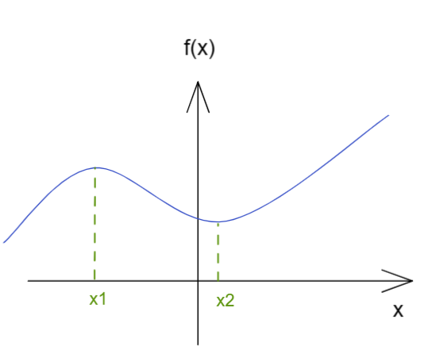
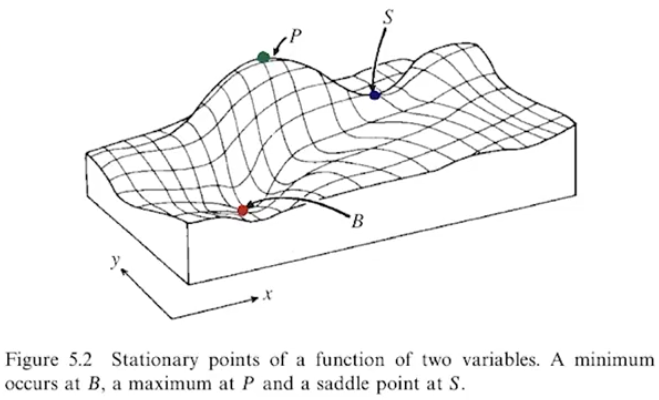
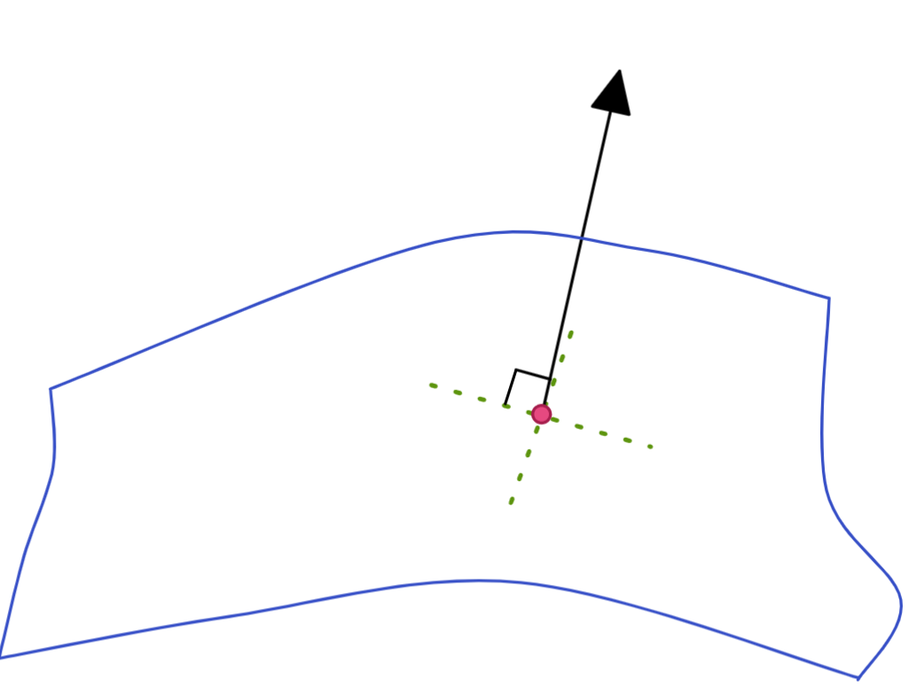

[TOC]

## 驻点 Stationary Point

驻点(Stationary Point)又称为平稳点、稳定点或临界点

$df =0$

$\frac{df}{dx}dx=0 \rightarrow \frac{df}{dx} =0$

我们使用泰勒展开式

$f(x)=f(x_0)+f'(x_0)\Delta x + \frac{1}{2!}f''(x_0)\Delta x ^2 + ... ,\Delta x<<1$

由于 差分很小 , 那么我们可以忽略高阶项，且一阶导为0，则

$\Delta f=f(x)-f(x_0)=\frac{1}{2!}f''(x_0)\Delta x ^2 $

所以函数的变化在驻点附近基本都像是抛物线

那么在该点的二阶导数的正负决定了驻点是最大还是最小

$f''(x_0) > 0 , min \\ f''(x_0) < 0 ,max$

## 多元函数驻点

有xy多元函数图像如下：

S点为鞍点 Saddle， P点为峰点Peak，B点为洼点Basin，三者都是驻点

那么我们如何考察驻点？同样是将函数微分；

$df=0 \rightarrow \frac{\part f}{\part x}dx +\frac{\part f}{\part y}dy=0 \rightarrow \frac{\part f}{\part x}=0,  \frac{\part f}{\part y} =0$

我们定义梯度 Gradient算符

$\vec\nabla f \equiv (\frac{\part f}{\part x},\frac{\part f}{\part y} ) \rightarrow df = \vec\nabla f\cdot d \vec r,d \vec r = (dx,dy) $

其中 $\vec r $  是一个任意向量，当我们要求  $df =10$  时，必定推得 $\vec\nabla f =0$ 即梯度为0 ，即为驻点 ；

为何如此呢？从泰勒展开即可看出来

$\Delta f=f(x,y) - f(x_0,y_0)=\sum\limits_i\frac{\part f}{\part x_i}\Delta x_i+\frac{1}{2!}\sum\limits_{ij}\frac{\part^2 f}{\part x_i\part x_j}\Delta x_i\Delta x_j+...$

一阶导依旧是0  同样由于 dx dy 很小 可以忽略高阶项

$\Delta f= \frac{1}{2!}\sum\limits_{ij}\frac{\part^2 f}{\part x_i\part x_j}\Delta x_i\Delta x_j $

我们将二阶内得微分定义为矩阵

$M_{ij}=\frac{\part^2 F}{\part x_i\part x_j}\rightarrow M = \left ( \begin{matrix}
f_{xx} & f_{xy}   \\
f_{yx} & f_{yy}   \\ 
\end{matrix} \right ) $

则可以将二阶项写为矩阵形式 
$$
\Delta f 
=
\frac{1}{2}
\Delta x^\top M \Delta x
= 
\frac{1}{2}
\left ( \begin{matrix}
\Delta  x & \Delta  y  \\ 
\end{matrix} \right )
\left ( \begin{matrix}
f_{xx} & f_{xy}   \\
f_{yx} & f_{yy}   \\ 
\end{matrix} \right )
\left ( \begin{matrix}
\Delta  x  \\
\Delta  y  \\ 
\end{matrix} \right )
$$

>  对于方阵特性
>
> Trace：
>
> $trM = \sum\limits_iM_{ii} = M_{11}+M_{22}$
>
> Determinant
>
> $detM = \left | \begin{matrix}
> M_{11} & M_{12}  \\
> M_{21} & M_{22}  \\ 
> \end{matrix} \right | = M_{11}M_{22}-M_{12}M_{21}$

 

回到最初图片

$Basin：  	detM >  0 , trM > 0  $

$Peak ：  	detM >  0 , trM < 0  $

$Saddle：  	detM <  0   $

  

## 带约束驻点

当我们需要最优化一个多元函数的时候(这个动作通常是求极值)，需要使用拉格朗日乘子使得问题变得简单

### 拉格朗日乘子法 lagrange multiplier

我们对多元函数引入一个新量   $\lambda$   构造一个新函数

$f^*(x,y,\lambda) = f(x,y)+\lambda g(x,y)$

那么我们直接对新的函数求极值

$df^*=0 \rightarrow \frac{\part f^*}{\part x}dx+\frac{\part f^*}{\part y}dy+\frac{\part f^*}{\part \lambda}d\lambda=0$

由于每个微分都是任意小的数量 那么其因子必须为0才能让等式成立

$\frac{\part f^*}{\part x} =0 \rightarrow \frac{\part f}{\part x}+\lambda \frac{\part g}{\part x}=0$

$\frac{\part f^*}{\part y} =0 \rightarrow \frac{\part f}{\part y}+\lambda \frac{\part g}{\part y}=0$

$\frac{\part f^*}{\part \lambda} =0 \rightarrow g=0$

由于我们得到引入的g函数的在极值的时候为0，那么表明 原函数 和 新函数在极值时的结果是相等的 ；

### 例

求一个椭圆  $\frac{x^2}{a^2}+\frac{y^2}{b^2}=1$  的内接矩形面积最大情况 ；

#### 解1

我们写出内接矩形的面积计算公式   $A = 4xy$

并且构造一个新函数  $A^* = A +\lambda \Phi ，where\ \Phi=0$ 且取极值时引入函数为 0 保证新旧函数在极值处相等；

在所有内接矩形的情况下 椭圆方程的方程式不变的 那么我们设约束

 $\Phi = \frac{x^2}{a^2}+\frac{y^2}{b^2} - 1 \equiv 0$ 

那么我们对新函数微分

$\frac{\part A^*}{\part \lambda} =0 \rightarrow \Phi=\frac{x^2}{a^2}+\frac{y^2}{b^2} - 1 =0$

$\frac{\part A^*}{\part x} = 0 \rightarrow 4y+\frac{2\lambda}{a^2}x=0$

$\frac{\part A^*}{\part y} = 0 \rightarrow 4x+\frac{2\lambda}{b^2}y=0$

解方程

$8xy + 2\lambda(\frac{x^2}{a^2}+\frac{y^2}{b^2}) =8xy + 2\lambda=0  \rightarrow \lambda =-4xy$

带入微分式得到

$x=\frac{a}{\sqrt{2}} ,y=\frac{b}{\sqrt{2}} $

那么可见，内接面积最大的时候 长宽比就是椭圆的长短轴比；

$A_{max} = 2ab$

#### 解2

直接取出椭圆的三角函数参数表达

$x =a\cos\theta, y = b \sin\theta$

$A = 4xy = 4ab\cos\theta\sin\theta = 2ab \sin(2\theta),\theta\in[0,\frac{\pi}{2}]$

直接得出极值 

### 拉格朗日乘子在几何中的意义

在3D空间内有

$df=\frac{\part f}{\part x}dx+\frac{\part f}{\part y}dy+\frac{\part f}{\part z}dz=\vec\nabla f \cdot d\vec r$

如果我们的梯度不为0，那么结果一定会随着因子   $\vec r$  的任意微小变化而变化，那么这个极小区域本就不是平坦的，即不是驻点；

但如果梯度为0 可判断驻点，但如果要判断是否为极值依旧要进入高阶项观察其他变化；

但是如果因子$\vec r$ 并非任意微小的变化，我们将因子$\vec r$ 限制在一个曲面上面，则得到如下情况：

我们在3D空间有一个曲面  $\Phi(x,y,z)=0$，因子$\vec r$ 只能在这个曲面上运动；

由于点在整个曲面上运动的时候， $\Phi(x,y,z)=0$始终成立，那么意味着 

 $d\Phi=0 = \vec\nabla\Phi\cdot d\vec r$

由于因子$\vec r$ 在曲面上是任意的向量，那么与该向量点乘永远为零的向量一定为曲面的法向量，由此我们可以得到$ \vec\nabla\Phi$ 就是曲面的法向量；

此时空间中驻点的条件变成了

$\vec\nabla f \cdot d\vec r = 0+\vec\nabla \Phi \cdot d\vec r =0$

此时因子$\vec r$ 在平面上，那么$\vec\nabla f$  只需要满足  $\vec\nabla f \mathop{//} \vec\nabla \Phi$ 即可

进一步就得到

$\vec\nabla f +\lambda \vec\nabla \Phi =0$

这就是拉格朗日算子法的来历；

