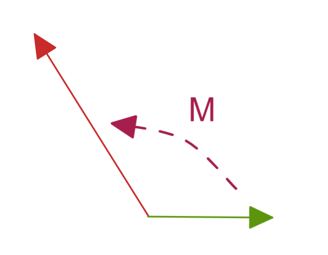

$$
R = 
\left (\begin{matrix}
a & b   \\
c & d   \\ 
\end {matrix}\right )
$$

[TOC]

 

#### 逆矩阵存在判定

如果操作为线性的，那么求逆矩阵只需要满足  $detA\neq 0$ 即可

$detA\neq 0  $   称为  non-singular  matrix

$detA = 0 $   称为  singular  matrix

 non-singular  matrix  存在逆矩阵

$A^{-1}|y\rangle = |x\rangle \rightarrow A^{-1}A|x\rangle = |x\rangle \rightarrow A^{-1}A=I$

$A |x\rangle = |y\rangle \rightarrow A A^{-1}|y\rangle = |y\rangle \rightarrow AA^{-1}=\mathbf{1}$

#### 逆矩阵计算方法

$$
(A^{-1})_{ij}=\frac{1}{|A|}c_{ji} \\ c_{ij}=(-1)^{i+j}M_{ij}
$$

#### 例 旋转矩阵的逆矩阵

$R_z(\theta)
=  
\left (\begin{matrix}
\cos\theta & -\sin\theta & 0   \\
\sin\theta & \cos\theta  & 0   \\
0 & 0 & 1  		\\ 
\end {matrix}\right )   
   $

$R^{-1}_{11}
=  (-1)^{1+1}
\left |\begin{matrix}
\cos\theta & 0    \\
0 & 1     \\ 
\end {matrix}\right |   = \cos\theta
 $

$R^{-1}_{12}
=  (-1)^{1+2}
\left |\begin{matrix}
-\sin\theta & 0    \\
0 & 1     \\ 
\end {matrix}\right |   = \sin\theta
 $

$R^{-1}
=  
\left (\begin{matrix}
\cos\theta &  \sin\theta & 0   \\
-\sin\theta & \cos\theta  & 0   \\
0 & 0 & 1  		\\ 
\end {matrix}\right )  = R ^\top 
   $

可以得到正交矩阵的特性

$RR^{-1}=R^{-1}R=I=RR^\top=R^\top R$

----------

### 本征向量 

有一矩阵对向量操作：  

$M|x\rangle = |y\rangle$

那么这个变换方式是否有可能，在变换前后使得向量方向不变 ，只有大小变化

$M|m\rangle = \lambda|m\rangle$

这里我们称 $\lambda$  为本征值 ；

#### 例

$\left (\begin{matrix}
5 & -2     \\
-2 & 2     \\ 
\end {matrix}\right )  $  满足 $M|m\rangle = m|m\rangle$

$\left (\begin{matrix}
5 & -2     \\
-2 & 2     \\ 
\end {matrix}\right )
\left (\begin{matrix}
x     \\
y     \\ 
\end {matrix}\right )
=
m
\left (\begin{matrix}
x     \\
y     \\ 
\end {matrix}\right )$

 $\left (\begin{matrix}
5-m & -2     \\
-2 & 2-m     \\ 
\end {matrix}\right )
\left (\begin{matrix}
x     \\
y     \\ 
\end {matrix}\right )
\rightarrow 
\left |\begin{matrix}
5-m & -2     \\
-2 & 2-m     \\ 
\end {matrix}\right | = 0 $

所以 $m=1,6$  带回原式，得到两个本征向量

$V_{m_1=1}=
\left (\begin{matrix}
x     \\
y     \\ 
\end {matrix}\right ) 
=
\frac{1}{\sqrt{5}}
\left (\begin{matrix}
1     \\
2     \\ 
\end {matrix}\right ) ,m=1$

$V_{m_2=6}=
\left (\begin{matrix}
x     \\
y     \\ 
\end {matrix}\right ) 
=
\frac{1}{\sqrt{5}}
\left (\begin{matrix}
-2     \\
1     \\ 
\end {matrix}\right ) ,m=6
$

 两个本征向量的关系

$\lang V_{m_1=1}|V_{m_2=6} \rang = 0$

由此意外发现，两个本征向量 就是两个互相垂直可以构造二维空间的基向量 

$\lang m| m'\rang = \delta_{mm'}$

当我们扩展至任意向量的时候，试图使用 向量的基向量构造式

$|v\rang=\sum\limits_m c_{m_1}|\vec V_{m_1}\rang 
\rightarrow 
\lang \vec V_{m_2}|v\rang=\sum\limits_m c_{m_1}\lang \vec V_{m_2}|\vec V_{m_1}\rang 
\rightarrow 
c_{m_2}=\lang \vec V_{m_2}|v \rang $

由此求出任意向量在和基向量关系的系数，其实就是内积即对每个基向量的投影；

依旧看上式

$
|v\rang
=
\sum\limits^m_i c_i|\vec V_i\rang 
=
\sum\limits^m_i |\vec V_i\rang c_i
=
\sum\limits^m_i |\vec V_i\rang \lang \vec V_i|v \rang
=
(\sum\limits^m_i |\vec V_i\rang \lang \vec V_i|)|v \rang
$

所有的本征向量与自己外积和的结果为单位阵
$$
\sum\limits_i^m |\vec V_i\rang \lang \vec V_i| =I
$$

#### 构造原矩阵

我们可以根据本征向量$\vec V_i$  和本征值$\lambda$得到如下
$$
M = \sum\limits_i^m \lambda|\vec V_i\rang \lang \vec V_i|=\lambda I
$$

我们可以看出一个本征矩阵可以等同于 单位阵的翻倍；
可以使用已知的【本征向量$\vec V_i$】以及 【本征值$\lambda$】构建原矩阵；

证：

$M|v\rang 
=
\sum\limits_i^m \lambda|\vec V_i\rang \lang \vec V_i| v\rang
=
\lambda|v\rang (\sum\limits_i^m |\vec V_i\rang \lang \vec V_i|)
=
\lambda|v\rang$

证2：

对任意向量

$
|v\rang 
=
\sum\limits_i^m |\vec V_i\rang\lang \vec V_i|v\rang
= 
\sum\limits_i^m C_i|\vec V_i\rang 
\\
C_i = \lang \vec V_i|v\rang 表达为对基向量的投影结果系数$

当原本的矩阵作用在向量上

$M|v\rang 
=
\sum\limits_i^m M|\vec V_i\rang\lang \vec V_i|v\rang
=
\sum\limits_i^m \lambda|\vec V_i\rang\lang \vec V_i|v\rang
=
(\sum\limits_i^m \lambda|\vec V_i\rang \lang \vec V_i|) |v\rang
  $
所以可以得到 $M = \sum\limits_i^m \lambda|\vec V_i\rang \lang \vec V_i|$

------

将时间引入三维空间，得到四维线性空间；
$$
\left (\begin{matrix}ct' \\ x' \\ y' \\ z'  \end {matrix}\right )=  \left (\begin{matrix}\gamma & -\gamma\frac{u}{c} & 0 & 0  \\-\gamma\frac{u}{c}& \gamma  & 0 & 0  \\0 & 0 & 1 & 0  		\\0 & 0 & 0 & 1  		\\\end {matrix}\right )\left (\begin{matrix}ct  \\ x  \\ y  \\ z   \end {matrix}\right )\\\gamma = \frac{1}{\sqrt{1-(u/c)^2}}
$$
我们进行简化 去掉两个不影响的轴

洛伦兹转换 的向量空间 叫做 闵可夫斯基空间 ，这会导致可以使用三角表达矩阵中元素；

$\cosh \alpha=\gamma=\frac{1}{\sqrt{1-(u/c)^2}} $

$\sinh\alpha=\frac{\gamma u}{c}=\frac{u/c}{\sqrt{1-(u/c)^2}} $

$\cosh^2x-\sinh^2x=1$

那么上述变化简化为

-----

### 洛伦兹变换 详解

我们直接使用本章粗略讲解洛伦兹时候的简化式开始，
$$
\left (\begin{matrix}ct' \\ x' \end {matrix}\right )=  \left (\begin{matrix}\cosh\alpha  & -\sinh\alpha  \\-\sinh\alpha &  \cosh\alpha  \\\end {matrix}\right )\left (\begin{matrix}ct  \\ x  \end {matrix}\right )\\
$$
同时我们也设定了如下表达

$\cosh \alpha=\gamma=\frac{1}{\sqrt{1-(u/c)^2}} $

$\sinh\alpha=\frac{\gamma u}{c}=\frac{u/c}{\sqrt{1-(u/c)^2}} $

$\cosh^2x-\sinh^2x=1$

现在，我们开始对变换矩阵做对角化，行列式

$\left |\begin{matrix}
\cosh\alpha -\lambda  & -\sinh\alpha  \\
-\sinh\alpha &  \cosh\alpha -\lambda  \\
\end {matrix}\right |
=0
\Rightarrow 
(\lambda-\cosh\alpha)^2-\sinh^2\alpha
\Rightarrow 
\lambda_\pm=\cosh\alpha\pm\sinh\alpha$

由此开始求洛伦兹矩阵的本征向量

$\left (\begin{matrix}
\cosh\alpha  & -\sinh\alpha  \\
-\sinh\alpha &  \cosh\alpha  \\
\end {matrix}\right )
\left (\begin{matrix}
a  \\ 
b  \\
\end {matrix}\right ) 
=
\lambda_\pm
\left (\begin{matrix}
a  \\ 
b  \\
\end {matrix}\right )
\Rightarrow 
b= \mp a
\Rightarrow 
v_1 =\frac{1}{\sqrt{2}}
\left (\begin{matrix}
1  \\ 
-1  \\
\end {matrix}\right ),
v_2 =\frac{1}{\sqrt{2}}
\left (\begin{matrix}
1  \\ 
1  \\
\end {matrix}\right ) 
$

那么这些本征向量和本征值的物理意义是什么？

观察 a 和 b 的本征向量内的比例关系，可见其 x轴 和 时间 无论向前或向后运动比例都相同，
无论在何种坐标系观察有一个东西的速度总是不变，那么我们知道光速才有这个特性；

所以我们通过求得洛伦兹转换矩阵的本征向量获得了光速不变性的佐证   $x=\pm ct$

那么本征值是什么物理意义？我们定义一个光

$\omega = c k$

$\left (\begin{matrix}
\omega' \\ 
ck' \end {matrix}\right )
=  
\left (\begin{matrix}
\cosh\alpha  & -\sinh\alpha  \\
-\sinh\alpha &  \cosh\alpha  \\
\end {matrix}\right )
\left (\begin{matrix}
\omega    \\ 
ck  	\\
\end {matrix}\right )  
\\ $

$\left (\begin{matrix}
\omega' \\ 
\omega \end {matrix}\right )
=  
\left (\begin{matrix}
\cosh\alpha  & -\sinh\alpha  \\
-\sinh\alpha &  \cosh\alpha  \\
\end {matrix}\right )
\left (\begin{matrix}
\omega    \\ 
\omega   	\\
\end {matrix}\right )  
\\ $

$\omega'= (\cosh\alpha-\sinh\alpha)\omega
\rightarrow
\frac{\omega'}{\omega}=\cosh\alpha-\sinh\alpha   
$

由于我们上述的定义

$\frac{\omega'}{\omega}
=\frac{1}{\sqrt{1-(u/c)^2}} - \frac{u/c}{\sqrt{1-(u/c)^2}}
=\frac{1-u/c}{\sqrt{(1-u/c)(1+u/c)}} 
=\sqrt{\frac{1-u/c}{1+u/c}}
=\sqrt{\frac{c-u}{c+u}} 
< 1$

这里本征值表达就是光的多普勒效应
如果换一个对面的位置做观察，同样可以和上述类似步骤得到 $\sqrt{\frac{c+u}{c-u}} >1  $

------

### 矩阵对角化

首先并非所有矩阵都可以对角化，需要能够求出特征向量和特征值，且数量和其秩等同才行；

在一个正交空间A中有矩阵M，我们使用该空间自身的正交基表达这个矩阵，但该矩阵每个位置都有非0元素，而我们想要对其做简化；
于是我们将该矩阵M自身的一组特征向量和特征值求出（我简称 **特征库**，特征库包含了特征向量和特征值以及构建规则），再次计算该组**特征库**对空间A的正交基的各方面影响，即**特征库**中的特征向量替换为正交空间A基向量，此时就将矩阵M的特征向量影响去除，仅留下特征值影响，而特征值仅仅影响每个特定方向，故会出现非常规整的对角矩阵，由此完成对矩阵M的对角化简化；

其实我们可以假设一个M 为待定的**核心矩阵** ，其在不同正交基构成的空间中的表达不同；

$M_{ij}=\lang e_i| M | e_j\rang$   一组正交基构成空间A，两个基底表达为 I J  ，然后该核心矩阵在空间A中的表达如此，此时该表达是非解耦的；

核心矩阵使用自己的特征库表达出来，两个基底表达为 K W  ，（假设二维可按两个方向展开表达）；
所有正交基与自身转置外积之和为单位阵（或翻倍），注意这里的特征向量不一定是单位向量，但是建议将其单位化 

 $ M = \sum\limits_k c_k|\vec v_k\rang\lang \vec v_k| = \sum\limits_w c_w|\vec v_w\rang\lang \vec v_w|$

那么将核心矩阵的表达代入其在空间A的表达 ，即为 将特征库应用到A空间表达出来，核心矩阵特征向量最终消弭

$D_{ij}=\lang \vec v_i|M|\vec v_j\rang =
\lang \vec v_i|(\sum\limits_k c_k|\vec v_k\rang\lang \vec v_k|)|\vec v_j\rang =
\sum\limits_k c_k\lang \vec v_i|\vec v_k\rang\lang \vec v_k|\vec v_j\rang =
\sum\limits_k c_k\delta_{ik}\delta_{kj}  =
\sum\limits_k c_k\delta_{ij} \\
\rightarrow
D_{ij} =c_i\delta_{ij}=c_j\delta_{ij}$

此时我们得到了一个对角矩阵，整个对角上的数字即为核心矩阵M的各个特征值；

至此，将原有矩阵在空间A中解耦为对角矩阵，其实对角化方法可用简单的高斯消元法进行；

### 相似矩阵

例：

依旧使用矩阵
$
M_{ij} = \lang e_i|M|e_j \rang
=
\left (\begin{matrix}
5 & -2     \\
-2 & 2     \\ 
\end {matrix}\right )  $   

我们之前计算过其特征值为 $m=1,6$  
特征向量

$V_1=
\frac{1}{\sqrt{5}}
\left (\begin{matrix}
1     \\
2     \\ 
\end {matrix}\right ) ,m=1$
$V_2
=
\frac{1}{\sqrt{5}}
\left (\begin{matrix}
-2     \\
1     \\ 
\end {matrix}\right ) ,m=6
$

由上述对角化得到其对角矩阵为
$D_{ij} = \lang m_i|M|m_j\rang =
\left (\begin{matrix}
1 & 0     \\
0 & 6     \\ 
\end {matrix}\right )  $

虽然我们可以使用高斯消元法做对角化 ， 但我们这里使用狄拉克符号做计算；

我们看到两个正交基  的关系其实就是一个线性变换，这里由于同原点则可看作转动

$|m_j\rang=S|e_j\rang
\rightarrow
S_{ij}=\lang e_i|S|e_j\rang 
=
\lang e_i|m_j\rang$

接下来我们需要证明如下一个相似变换：
$$
S^{-1}MS=D
$$
证：

由于S变化是转动，那么其逆矩阵即为其转置矩阵  $S^{-1}=S^\top$

$
(S^{-1}MS)_{ij}
=
(S^{\top}MS)_{ij}
= 
\sum\limits_{kw} S^{\top}_{ik}  M_{kw}  S_{wj} 
=
\sum\limits_{kw} \lang m_i|e_k\rang   \lang e_k|M|e_w\rang \lang e_w|m_j\rang 
=
\lang m_i|M|m_j\rang = m_i\delta_{ij} = D_{ij}
$

该动作叫相似转换

### 对角矩阵应用

#### 对角矩阵的计算

$D_{ij} = d_i\delta_{ij}$

$D^2_{ij}=\sum\limits_k D_{ik}D_{kj}=\sum\limits_k d_i\delta_{ik}d_j\delta_{kj} = d_i^2\delta_{ij}
\rightarrow
(D^n)_{ij}=d_i^n\delta_{ij}$

也可从相似转换看到  $M=SDS^{-1}$

$M^n=M \cdot M \cdot M... = (SDS^{-1})(SDS^{-1})(SDS^{-1})...=S(D \cdot D \cdot D ...)S^{-1}=SD^nS^{-1}$

**可见对角矩阵相乘结果还是对角矩阵**

### 交换矩阵：

$[A,B]=AB-BA=0$

$(AB)_{ij}=\sum\limits_k a_i\delta_{ik}b_k\delta_{kj}=a_ib_i\delta_{ij}$

$(BA)_{ij}=\sum\limits_k b_i\delta_{ik}a_k\delta_{kj}=b_i a_i\delta_{ij}=a_ib_i\delta_{ij}$

也可从相似转换看到,若AB为可对角化的非对角矩阵，此时矩阵是一般的样子

$A'=SAS^{-1} \rightarrow A=S^{-1}A'S$

$B'=SBS^{-1} \rightarrow B=S^{-1}B'S$

$[A',B']=A'B'-B'A' \\=
SAS^{-1} \cdot SBS^{-1} - SBS^{-1} \cdot SAS^{-1} =
SABS^{-1} - SBAS^{-1} \\=
S(AB-BA)S^{-1}=S[A,B]S^{-1}=0$

如果两个矩阵使用相同的基底都可以对角化，那么这两者为交换矩阵，即便其表达方式不一定是对角化的；

#### 例 二次曲线

我们有公式来表达平面上的椭圆

$5x^2-4xy+2y^2=30$ 

也可以写为

$\left (\begin{matrix}
x & y    
\end {matrix}\right ) 
\left (\begin{matrix}
5 & -2     \\
-2 & 2     \\ 
\end {matrix}\right ) 
\left (\begin{matrix}
x   \\
y   \\ 
\end {matrix}\right )
=30 $

如果我们使用其对角矩阵来替换这个看起来一般的矩阵

$\left (\begin{matrix}
x' & y'    
\end {matrix}\right ) 
\left (\begin{matrix}
1 & 0     \\
0 & 6     \\ 
\end {matrix}\right ) 
\left (\begin{matrix}
x'   \\
y'   \\ 
\end {matrix}\right )
=30 
\rightarrow
x'^2+y'^2=30$

其表达就成了一个标准椭圆公式，只不过我们取的不是现有直角坐标系的基向量来表达；

#### 例：再提耦合振子

我们写出该模型的运动方程Equations Of Motion EOM；

$m\frac{d^2x_1}{dt^2}=-k_1x_1+k_{12}(x_2-x_1) \\ m\frac{d^2x_2}{dt^2}=-k_2x_2-k_{12}(x_2-x_1)$

将该式展开 可以拟出一个矩阵

$m \left (\begin{matrix}
\ddot x_1   \\
\ddot x_2   \\ 
\end {matrix}\right ) 
=
-\left (\begin{matrix}
k_1+k_{12} & -k_{12}   \\
-k_{12} & k_2+k_{12}    \\ 
\end {matrix}\right ) 
\left (\begin{matrix}
x_1   \\
x_2   \\ 
\end {matrix}\right )$

我们得到了一个对称的实数矩阵，那么如果此处的$k_{12}=0$ 那么两个物体的运动则充分解耦，其实也就是说中间弹簧不参与力的运算，即处于自然状态，那么其实就是两个物体运动方式一样；我们可是使用特征向量来证明；

为了简化 我们将所有的弹簧力取为K 即为 $K_1=K_2=K_{12}=K$

那么中间的振动矩阵就简化为如下

$IK=
\left (\begin{matrix}
2K & -K   \\
-K & 2K   \\ 
\end {matrix}\right ) $

我们求这个矩阵的特征值和特征向量

$IK=
\left |\begin{matrix}
2K & -K   \\
-K & 2K   \\ 
\end {matrix}\right |=0
\rightarrow
(\lambda-2K)^2-K^2=0 
\rightarrow
\lambda=K,3K$

$|K\rang = 
\frac{1}{\sqrt{2}}
\left (\begin{matrix}
1   \\
1   \\ 
\end {matrix}\right ) 
,
|3K\rang = 
\frac{1}{\sqrt{2}}
\left (\begin{matrix}
1   \\
-1   \\ 
\end {matrix}\right ) $

由此我们得到两个特征向量 以及两个特征值 ，
两个特征向量互不影响，那么就代表了该系统的两个特殊的振动，特殊振动中两个振子互不影响、互相独立，
这两个振动一个是上述的中间弹簧不参与力的运算的同相运动，还有一个就是同时相向并相离（相向）振动； 

同向振动时，频率为 $\omega_1 = \sqrt{\frac{K}{m}}$

相向振动时，频率为 $\omega_2 = \sqrt{\frac{3K}{m}}$

 

